# 01 — Concepts and Data Model

This document defines the on-disk state that `gt` manages and all file formats. A correct
re-implementation must read and write these formats byte-compatibly, because consumer projects commit
some of these files to version control and share them across machines and tool versions.

## 1. Working directory layout

All state lives under a single **working directory** (`workingDir`, default `.gt`). The path may be
overridden per invocation with `-w|--working-directory`. Layout:

```
<workingDir>/                         (default: .gt)
└── remotes/
    └── <remote>/
        ├── pull.args                 default gt-pull arguments for this remote (committed)
        ├── pulled.tsv                ledger of pulled files (committed)
        ├── gitconfig                 saved git config to restore the repo (committed)
        ├── pull-hook.sh              optional consumer hook (committed)
        ├── public-keys/
        │   ├── signing-key.public.asc      imported signing key(s) (committed)
        │   ├── signing-key.public.asc.sig  its signature (committed)
        │   └── gpg/                          GPG home dir for this remote (NOT committed)
        │       ├── pubring.kbx
        │       ├── trustdb.gpg
        │       └── signing-key.last-check.txt   date (YYYY-mm-dd) of last revocation re-check
        └── repo/                     local git working copy used for fetching (NOT committed)
            └── .git/ ...
```



```mermaid
graph TD
    WD["&lt;workingDir&gt; (.gt)"] --> R[remotes/]
    R --> RN["&lt;remote&gt;/"]
    RN --> PA[pull.args]
    RN --> PT[pulled.tsv]
    RN --> GC[gitconfig]
    RN --> PH[pull-hook.sh]
    RN --> PK[public-keys/]
    RN --> REPO[repo/]
    PK --> SK[signing-key.public.asc]
    PK --> SKS[signing-key.public.asc.sig]
    PK --> GPG[gpg/ &#40;GPG home&#41;]
    GPG --> LC[signing-key.last-check.txt]
    REPO --> DOTGIT[.git/]

    classDef committed fill:#d9ead3,stroke:#38761d;
    classDef ignored fill:#f4cccc,stroke:#990000;
    class PA,PT,GC,PH,SK,SKS committed;
    class GPG,LC,REPO,DOTGIT ignored;
```

Green = normally committed to the consumer's VCS; red = local-only (recommended `.gitignore` entries
`<workingDir>/**/repo` and `<workingDir>/**/gpg`). `gt` itself does not enforce git-ignoring; it only
*offers* to add the patterns during the first `remote add` (see [04](04-command-remote.md)).

### Canonical path constants

These are derived from `workingDirAbsolute` and `remote` (reference: `src/paths.source.sh`). A
re-implementation should centralize them identically:

| Name | Value |
|------|-------|
| `remotesDir` | `<workingDir>/remotes` |
| `remoteDir` | `<remotesDir>/<remote>` |
| `publicKeysDir` | `<remoteDir>/public-keys` |
| `repo` | `<remoteDir>/repo` |
| `gpgDir` | `<publicKeysDir>/gpg` |
| `pulledTsv` | `<remoteDir>/pulled.tsv` |
| `pullArgsFile` | `<remoteDir>/pull.args` |
| `pullHookFile` | `<remoteDir>/pull-hook.sh` |
| `gitconfig` | `<remoteDir>/gitconfig` |
| `lastSigningKeyCheckFile` | `<gpgDir>/signing-key.last-check.txt` |

All paths used internally are **absolute** (`workingDir` is resolved via `readlink -m`, i.e. canonicalized
without requiring existence).

## 2. `pulled.tsv` — the pulled-files ledger

A tab-separated file, one row per pulled file, recording everything needed to re-pull/update. It is the
authoritative record; the actual pulled files on disk are derived data.

### Structure

- **Line 1** — version pragma: `#@ Version: <x.y.z>` (current latest: `#@ Version: 1.2.0`).
- **Line 2** — header (tab-separated): `tag	file	relativeTarget	tagFilter	hasPlaceholder	sha512`
- **Line 3+** — entries.

Example (tabs shown as `→`):

```
#@ Version: 1.2.0
tag→file→relativeTarget→tagFilter→hasPlaceholder→sha512
v4.12.0→src/utility/io.sh→../lib/tegonal-scripts/src/utility/io.sh→.*→false→c3a08480047e9f51...
```

### Columns (format 1.2.0)

| # | Column | Meaning |
|---|--------|---------|
| 1 | `tag` | git tag the file was pulled from |
| 2 | `file` | path **inside the remote repository** that was pulled (the source path) |
| 3 | `relativeTarget` | target file location, **relative to `workingDir`** (so the ledger is location-independent) |
| 4 | `tagFilter` | the `grep -E` tag filter recorded for this file (`.*` if none) |
| 5 | `hasPlaceholder` | `true`/`false` — whether the file contains any `gt-placeholder` marker |
| 6 | `sha512` | lowercase hex sha512 of the file content as pulled |

Notes / invariants:
- The `file` column (source path) is the **key**: there is at most one entry per source path per remote.
  Lookups escape regex metacharacters in the file path and match with anchor `^[^\t]+\t<escapedFile>`.
- `relativeTarget` is computed with `realpath --relative-to=<workingDir>` of the absolute target. With
  the default pull dir `lib/<remote>` and default working dir `.gt`, targets typically begin with `../`.
- `sha512` is computed via `sha512sum`, taking the first whitespace-delimited field (the hash).
- A new `pulled.tsv` is initialized with the version-pragma line + header line when the first file for a
  remote is pulled.

### Entry serialization

An entry line is exactly: `tag\tfile\trelativeTarget\ttagFilter\thasPlaceholder\tsha512\n` (six tab-
separated fields, trailing newline). Reading splits on tab into the six fields in order.

See [13-pulled-tsv-migrations.md](13-pulled-tsv-migrations.md) for older formats (unspecified/1.0.0/1.1.0)
and the automatic migration logic.

## 3. `pull.args` — per-remote default arguments

A text file whose **lines are appended (as if typed on the command line) before** the user's own
arguments on every `gt pull` for this remote. Each line is split using shell word-splitting via
`eval 'args+=(<line>)'`, so values may be quoted.

Typical contents written by `remote add`:

```
--directory "lib/tegonal-scripts"
```

`remote add` writes:
1. `--directory "<pullDir>"` (always).
2. `--tag-filter "<tagFilter>"` (only if a non-default tag filter `!= .*` was given).
3. `--unsecure true` (appended if the remote turned out to have no GPG key and `--unsecure true` was set).

Because these lines are prepended to user arguments and later arguments win (last-wins; see
[02](02-cli-and-argument-parsing.md)), a user can override any default by passing the option explicitly.

> Re-implementation note: parsing must respect shell quoting at least well enough for the values gt
> itself writes (a long option followed by a single double-quoted value). Implementations should support
> standard double-quote and single-quote grouping.

## 4. `gitconfig` — saved repository configuration

A copy of `repo/.git/config` taken right after `git remote add` during `remote add`. It is committed so
that machines which never ran `remote add` (e.g. a fresh clone of the consumer project running
`gt re-pull`) can re-create the throwaway `repo/.git` directory with the correct remote URL. Example:

```ini
[core]
	repositoryformatversion = 0
	filemode = true
	bare = false
	logallrefupdates = true
[remote "tegonal-scripts"]
	url = https://github.com/tegonal/scripts
	fetch = +refs/heads/*:refs/remotes/tegonal-scripts/*
```

`gt` re-initializes a missing/broken `repo` by running `git init` and copying `gitconfig` to
`repo/.git/config`. See [02](02-cli-and-argument-parsing.md) §repo-recovery and the per-command docs.

## 5. GPG stores

There are two relevant GPG homes:

- **The user's personal GPG store** (`gpg` default home). Used to verify the *signature of a remote's
  signing key* (`signing-key.public.asc.sig` against `signing-key.public.asc`). Trust here means "the
  user trusts whoever signed the remote's key".
- **The remote's GPG store** at `<publicKeysDir>/gpg` (`gpgDir`). Per-remote, created with `mkdir -p`
  then `chmod 700`. The remote's signing key is imported here after the user consents; subsequently it is
  used (`gpg --homedir <gpgDir> --verify`) to verify every pulled file's signature.

`signing-key.last-check.txt` inside `gpgDir` records the date (format `YYYY-mm-dd`) of the most recent
revocation re-check, used to throttle periodic re-checks (see [03](03-gpg-trust-model.md)).

## 6. The throwaway `repo`

`repo/` is a normal git repository used purely as a fetch/checkout scratch area. It is shallow
(`git fetch --depth 1 / --depth=1`). After each pull operation gt **removes all top-level directories**
in `repo` except `.git` (cleanup trap), keeping the `.git` metadata so future fetches are cheap. It is
local-only and recommended to be git-ignored.

## 7. State produced vs. consumed by each command (summary)

| Command | Reads | Writes |
|---------|-------|--------|
| `remote add` | URL, default branch's `.gt/` | `remotes/<r>/` tree, `pull.args`, `gitconfig`, `public-keys/`, imports signing key into `gpgDir` |
| `remote remove` | `pulled.tsv`, `pull-hook.sh` | deletes `remoteDir` (and optionally pulled files) |
| `remote list` | `remotes/*` directory names | — |
| `pull` | `pull.args`, `pulled.tsv`, remote git, `gpgDir` | pulled files, `pulled.tsv` entries, possibly `gpgDir`, `lastSigningKeyCheckFile` |
| `re-pull` | `pulled.tsv` per remote | re-pulled files |
| `update` | `pulled.tsv`, remote tags | updated files, updated `pulled.tsv` entries |
| `reset` | `public-keys/*.asc` policy, `pull.args` | re-creates `gpgDir`/`public-keys`, then re-pulls |
| `self-update` | install dir, remote `gt` tags | replaces gt installation |
