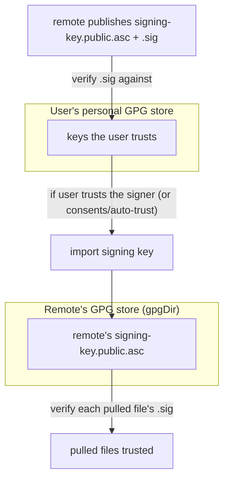
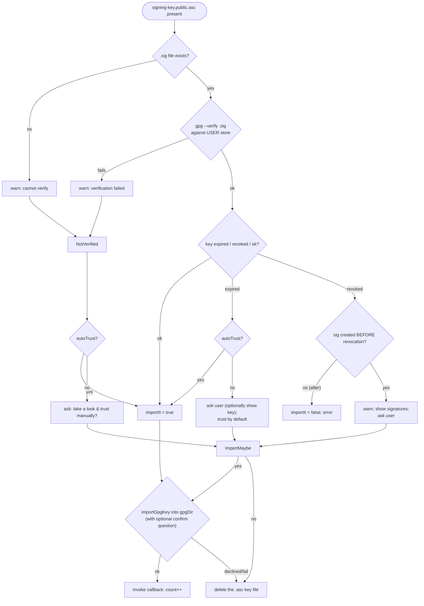
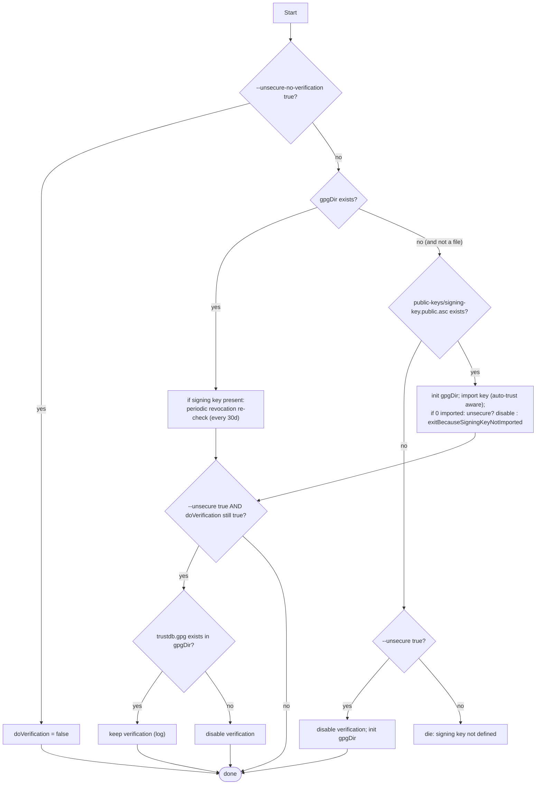

# 03 — GPG Trust & Verification Model

GPG verification is the core value proposition of `gt`. This document specifies the complete trust model:
how a remote's signing key is obtained and trusted, how pulled files are verified, and how expiration and
revocation are handled. The logic here is shared by `remote add`, `pull`, and `reset`.

## 1. Two trust layers

- **Layer 1 — trusting the remote's key.** The remote ships `signing-key.public.asc` and a detached
  signature `signing-key.public.asc.sig`. gt verifies that signature **against the user's personal GPG
  store**. The meaning: "do you (already) trust whoever signed this remote's signing key?". If yes, the
  key is imported automatically; if not (or no `.sig`), gt asks for explicit consent (unless
  `--auto-trust true`).
- **Layer 2 — verifying pulled files.** Once imported into the **remote's** `gpgDir`, the signing key is
  used to verify the detached `.sig` of every pulled file.

The two stores are intentionally separate: trusting a remote's files never pollutes the user's personal
keyring; it only populates the per-remote `gpgDir`.

## 2. Acquiring & importing the signing key (`validateSigningKeyAndImport`)

Input: the directory containing `signing-key.public.asc` (+ its `.sig`), the target `gpgDir`, the
`autoTrust` flag, and a callback invoked on successful import.

Algorithm:

Key points and details:

- **Verification store.** Layer-1 verification (`gpg --verify <sig> <publicKey>`) uses the **user's
  default** GPG home, *not* `gpgDir`. This is deliberate.
- **`confirm` question.** When `autoTrust=false` *and* the signature verified, no extra confirmation
  question is shown at import time (the verified signature is sufficient). When not auto-trusting and not
  verified, a confirmation question ("The above key(s) will be used to verify the files you will pull from
  remote `<remote>`, do you trust them?") is shown by `importGpgKey`.
- **Expired key**, signature otherwise valid: treated as "signature OK, trust assumed". With
  `autoTrust=true` it is imported silently; otherwise the user is told the key expired and asked whether
  they want to inspect it / still trust it. Default path leads to import.
- **Revoked key**: gt compares the **signature creation date** with the **revocation creation date**.
  - If the signature was created **before** revocation → warn, display the key's signatures (after a
    20-second auto-continue prompt), and ask the user whether to trust anyway.
  - If the signature was created **after** (or at) revocation → refuse (`importIt=false`, error). A
    signature made by an already-revoked key is never auto-trusted.
- **Not verified at all** (no `.sig`, or `.sig` failed): with `autoTrust=true`, import anyway (logged as
  a possible security risk); otherwise ask for manual consent.
- **On decline / failed import**: the `signing-key.public.asc` file is **deleted** ("for security
  reasons") so a non-trusted key is never left behind in `public-keys/`.
- **`importGpgKey`** (reference `gpg-utils.sh`): first does a dry-run (`--import-options show-only`) to
  display the key, optionally asks the confirmation question, then on yes imports with `--batch
  --no-tty --import` and sets owner-trust to ultimate (`5`) for each `pub` key via `--import-ownertrust`.
  If `gpgDir` path length ≥ 100 chars it symlinks it under a temp dir to avoid gpg's socket-path length
  limit, then cleans the symlink up.

### Counting imported keys

The import callback increments a counter. **Zero imported keys** is an error condition in the callers
(unless an `--unsecure`/unsecure-args policy permits it): the caller then either disables verification
(unsecure) or calls `exitBecauseSigningKeyNotImported` (which deletes `gpgDir` and exits `1`).

## 3. Where the signing key comes from per command

| Command | Source of `signing-key.public.asc` |
|---------|------------------------------------|
| `remote add` | Fetched from the remote's **default branch** `.gt/` directory via `checkoutGtDir`, then validated+imported by `importRemotesPulledSigningKey`. The validated key is **moved** into `public-keys/` and committed. |
| `pull` (first time, no `gpgDir`) | The already-committed `public-keys/signing-key.public.asc` is imported into a freshly-created `gpgDir`. |
| `reset` | Deletes `public-keys/` + `gpgDir`, re-fetches the key from the remote's default branch `.gt/` (like `remote add`), re-imports. |

`importRemotesPulledSigningKey` additionally:
1. Validates+imports from `repo/.gt/` (the freshly fetched copy).
2. Writes today's date (`YYYY-mm-dd`) to `lastSigningKeyCheckFile`.
3. Deletes `repo/.gt` (cleanup of the fetched working-dir copy).

`checkoutGtDir` fetches `--depth 1` the given branch and `git checkout <remote>/<branch> -- .gt`, then
removes any subdirectories under the checked-out `.gt` (it only wants the top-level key files). It returns
non-zero if the remote has no `.gt` directory, which callers map to the "unsecure" decision (below).

## 4. Per-file verification during pull

For each pulled regular file `f` (and its sibling `f.sig`), when verification is enabled:

1. If a directory already exists at the target with the file's name → `die`.
2. `gpg --homedir <gpgDir> --verify f.sig f`.
   - On failure → abort the pull of that file (`returnDying`, propagates as error).
   - On success → load the signing key's key-data; if the key **is revoked now** → abort (revoked key).
3. Delete `f.sig`, then move `f` into place (with placeholder substitution / hooks as applicable).

If verification is enabled but **no `.sig`** accompanies the file → warn, skip the file (delete it), and
suggest the `--unsecure`/`--unsecure-no-verification` options. If verification is disabled, the file is
moved without any signature handling.

> Consequence: with verification on, a file lacking a signature is **never** placed. A directory pull
> silently skips unsigned members and only counts the verified ones; if the net result is 0 files the
> command fails.

## 5. The `--unsecure` / `--unsecure-no-verification` matrix

Two independent knobs control how strict verification is. `--unsecure-no-verification true` **implies**
`--unsecure true`.

| `--unsecure-no-verification` | `--unsecure` | gpg store state | Effect |
|---|---|---|---|
| false | false | (any) | **Strict.** Missing signing key / failed verification / missing per-file sig ⇒ error. |
| false | true | not set up & no key available | Verification **disabled**; warn. (gpgDir is initialized so it isn't retried.) |
| false | true | set up (trustdb exists) **or** key available | Verification still **performed** (unsecure only relaxes the *absence* of keys, not skipping when keys exist). gt logs that it verifies despite `--unsecure true`. |
| true | (implied true) | (any) | **No verification at all.** Signatures are never fetched or checked. |

Decision logic in `pull` (reference `gt_pull_parse_args`), simplified:

When `gpgDir` is **a regular file** (corruption) the command dies with a "remote is broken" message.

## 6. Periodic revocation re-check (every 30 days, during `pull`)

If `gpgDir` exists and the committed signing key is present, `pull` checks `lastSigningKeyCheckFile`. If
the last recorded check is more than **30 days** ago (`doIfLastCheckMoreThanDaysAgo 30`), gt runs
`gt reset -r <remote> --gpg-only true` to re-fetch and re-validate the signing key (catching revocations
published since the key was first trusted). If that reset fails it `die`s, advising the user that they can
defer the check by editing the date in `lastSigningKeyCheckFile`.

`doIfLastCheckMoreThanDaysAgo` semantics:
- If the check file is missing, it treats the "last check" as `days+60` ago (so the check **does** fire).
- The stored date must be `YYYY-mm-dd` (`dateToTimestamp`); a malformed date is a fatal error.

## 7. Revocation / expiration data extraction (for re-implementers)

The reference shells out to `gpg` and parses `--with-colons` output. The semantically relevant
primitives a re-implementation must provide:

- **Signing key id of a signature**: from `gpg --list-packets <sig>`, the `keyid` field.
- **Key data**: `gpg --homedir <dir> --list-keys --with-colons <keyId>` filtered to `pub`/`sub` lines
  matching the key id.
  - **Expired** iff the `pub`/`sub` validity field is `e` (`^(sub|pub):e:`).
  - **Revoked** iff the validity field is `r` (`^(sub|pub):r:`).
  - **Key id** = field 5; **expiration timestamp** = field 7 (unix).
- **Signature creation date**: from `--list-packets`, the `sig created <YYYY-MM-DD>` field.
- **Revocation creation timestamp**: from `--list-sigs --with-colons`, the `rev:` record's field 6.

A re-implementation MAY use a GPG library or the GPG CLI; what matters is that the **decisions** (import /
refuse / ask) match §2 given the same key state, and that per-file verification (§4) accepts exactly the
signatures the reference accepts.

## 8. `exitBecauseSigningKeyNotImported`

When the signing key could not be imported and no unsecure policy permits proceeding: log an error
explaining `--unsecure true` and the manual alternatives (place the `.asc` in `public-keys/` or set up
`gpgDir` yourself), **delete `gpgDir`**, and `exit 1`. The deletion ensures gt never leaves a half-trusted
store behind.
