# 04 — `gt remote`

Manages remotes. Sub-commands: `add`, `remove`, `list`. Dispatcher behaves like the top level
(`--help`/`--version`, unknown sub-command → help + exit; see [02](02-cli-and-argument-parsing.md)).

## `gt remote add`

Registers a new remote, fetches and trusts its GPG signing key, and prepares its working-directory tree.

### Parameters

| Pattern | Required | Default | Meaning |
|---------|----------|---------|---------|
| `-r\|--remote` | yes | — | remote name (must match `^[a-zA-Z0-9_-]+$`) |
| `-u\|--url` | yes | — | URL of the remote git repository |
| `-d\|--directory` | no | `lib/<remote>` | default pull directory for this remote (written to `pull.args`) |
| `--tag-filter` | no | `.*` | default tag filter (written to `pull.args` only if not `.*`) |
| `--unsecure` | no | `false` | if `true`, tolerate a remote with no GPG key |
| `-w\|--working-directory` | no | `.gt` | working directory |

### Workflow



```mermaid
flowchart TD
    A[parse args; fill defaults] --> B[validate working dir inside currentDir;<br/>all required args set]
    B --> C{remote name matches regex?}
    C -- no --> die1[die]
    C -- yes --> D{working dir exists?}
    D -- no --> Dask["ask: create it?"] --> Dcreate["mkdir -p; offer to add<br/>.gitignore patterns"]
    D -- yes --> E
    Dcreate --> E[mkdir -p remotes/]
    E --> F{remoteDir state}
    F -- "is a file" --> die2[die: broken]
    F -- "exists w/ pulled.tsv" --> die3[returnDying: already exists]
    F -- "exists w/o pulled.tsv" --> Fask["ask: remove & continue?"] --> Frm["gt remote remove …"]
    F -- "does not exist" --> G
    Frm --> G[mkdir remoteDir; set cleanup-on-error trap]
    G --> H[write pull.args:<br/>--directory; maybe --tag-filter]
    H --> I[mkdir public-keys; init gpgDir; git init repo]
    I --> J[git remote add &lt;remote&gt; &lt;url&gt;;<br/>copy .git/config to gitconfig]
    J --> K[determine default branch]
    K --> L{checkout remote .gt dir?}
    L -- "no .gt dir" --> Lun{unsecure?}
    Lun -- yes --> Lwarn["warn; append --unsecure true to pull.args; SUCCESS exit 0"]
    Lun -- no --> Lerr[error; return 1]
    L -- yes --> M{signing-key.public.asc present in remote .gt?}
    M -- no --> Mun{unsecure?}
    Mun -- yes --> Mwarn["warn; append --unsecure true; exit 0"]
    Mun -- no --> Merr[error; return 1]
    M -- yes --> N[import signing key &#40;trust model&#41;]
    N --> O{imported &gt; 0 keys?}
    O -- no --> Oun{unsecure?}
    Oun -- yes --> Owarn[warn; exit 0]
    Oun -- no --> exitNotImported[exitBecauseSigningKeyNotImported]
    O -- yes --> P[gpg --list-sig; SUCCESS]
```

### Details

- **Working-directory creation.** If the working dir does not exist, gt asks to create it. On yes it
  `mkdir -p`s it and, if a `.gitignore` exists in `currentDir` and does not already mention
  `<workingDir>/`, asks whether to append gt's recommended ignore patterns:
  ```
  # gt (https://github.com/tegonal/gt)
  <workingDir>/**/repo
  <workingDir>/**/gpg
  ```
  On no (don't create), exit `9`.
- **Existing remote dir:**
  - regular file at `remoteDir` → broken → `die`.
  - directory **with** `pulled.tsv` → "already exists with pulled files" → fail (return non-zero).
  - directory **without** `pulled.tsv` → "exists but without pulled files"; ask to remove & continue; on
    yes call `remote remove`, on no return `1`.
- **Cleanup-on-error trap.** After `mkdir remoteDir`, an EXIT trap is armed: on any non-zero exit it
  deletes `remoteDir` and re-creates an empty `remoteDir` (so trust can be re-established manually without
  a half-built tree). On success the relevant operations have completed and the tree is kept.
- **`pull.args` contents:** always `--directory "<pullDir>"`; plus `--tag-filter "<tagFilter>"` if the
  filter ≠ `.*`; plus `--unsecure true` appended in each "unsecure tolerated" branch.
- **Default branch detection** (`determineDefaultBranch`): `git ls-remote --symref <remote> HEAD`, parse
  `ref: refs/heads/<branch>`; fall back to `main` (with a warning) if it cannot be determined.
- **GPG fetch/trust:** see [03](03-gpg-trust-model.md). On success prints `gpg --list-sig` and a SUCCESS
  message telling the user they can now `gt pull -r <remote> -p <PATH>`.

### Exit codes
`0` success; `1` GPG required but unavailable / not trusted / declined; `9` declined to create working
dir, or usual usage errors.

## `gt remote remove`

### Parameters

| Pattern | Default | Meaning |
|---------|---------|---------|
| `-r\|--remote` | — (required) | remote to remove |
| `--delete-pulled-files` | `false` | also delete every file listed in this remote's `pulled.tsv` |
| `-w\|--working-directory` | `.gt` | working directory |

### Workflow

1. Standard validation; `exitIfRemoteDirDoesNotExist` (if `remoteDir` is a regular file → error, return
   `1`; if missing → exit `9` after listing existing remotes).
2. If a `pull-hook.sh` exists → warn ("you might want to move it away first") and ask "shall I continue
   and delete it as well?"; on no → log aborted, **exit `10`**.
3. If `pulled.tsv` exists:
   - `--delete-pulled-files != true`: inform the user about the option and ask **"Shall I abort?"**. On
     yes → exit `10`. On no → proceed (remote removed, pulled files kept).
   - `--delete-pulled-files == true`: read `pulled.tsv` and `rm` each entry's target file, counting and
     logging the number deleted.
4. Delete `remoteDir` (`deleteDirChmod777`); SUCCESS.

> Note: only the recorded target files are deleted with `--delete-pulled-files true`; empty parent
> directories are not pruned.

## `gt remote list`

### Parameters

| Pattern | Default | Meaning |
|---------|---------|---------|
| `-w\|--working-directory` | `.gt` | working directory |

### Behaviour

- Standard validation (working dir must exist and be inside currentDir).
- Output = the **names of the immediate sub-directories of `remotesDir`**, sorted, one per line, to
  **stdout** (`find remotesDir -maxdepth 1 -type d` minus `remotesDir` itself, name only, `sort`).
- If there are **no** remotes: print an informational message ("No remote defined yet."), an empty line,
  a hint to use `gt remote add ...`, and then the output of `gt remote add --help`.
- There are two internal entry points: `gt_remote_list_raw` (pure list, used by other commands to iterate
  remotes) and `gt_remote_list` (adds the friendly empty-state message). The raw form treats a `--help`
  invocation (parser return `99`) as success.

`remote list -w <dir>` is the canonical way other commands enumerate remotes when no `-r` is given.
