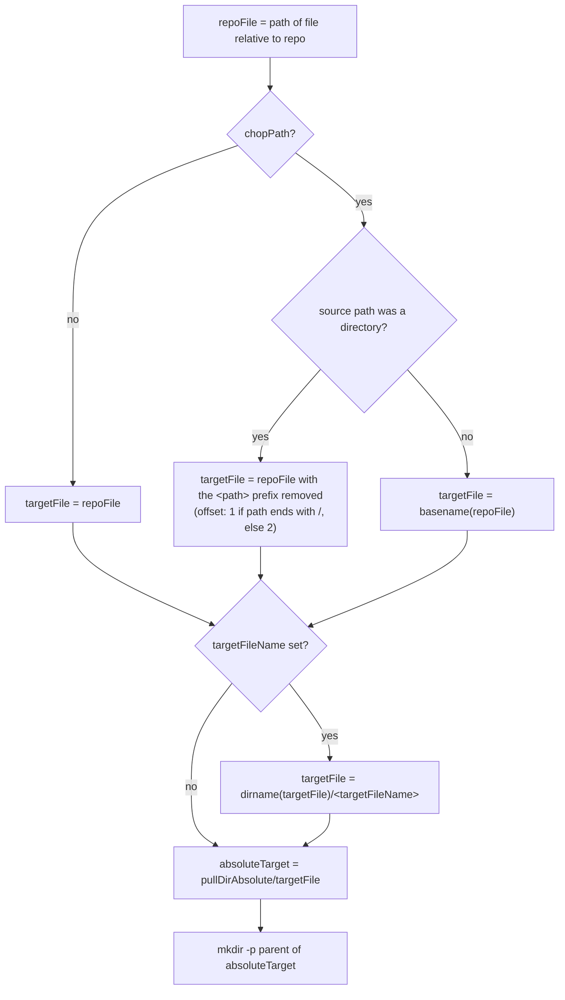
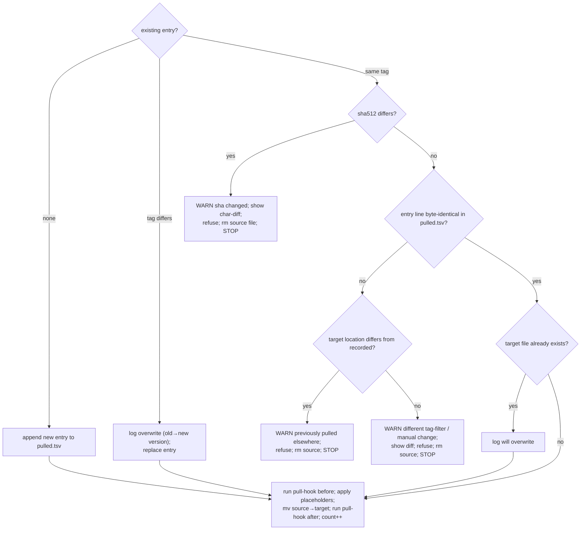

# 05 — `gt pull`

`pull` fetches a file or directory from a remote at a given (or latest matching) tag, verifies it, and
places it into the pull directory while recording the result in `pulled.tsv`. It is the engine reused by
`re-pull`, `update`, and (transitively) `reset`.

## Parameters

| Pattern | Required | Default | Meaning |
|---------|----------|---------|---------|
| `-r\|--remote` | yes | — | remote name |
| `-t\|--tag` | no | latest matching tag | git tag to pull from |
| `-p\|--path` | yes | — | path in the remote repo (file or directory); must not start with `/` |
| `-d\|--directory` | no | remote's configured pull dir (from `pull.args`) | target directory |
| `--chop-path` | no | `false` | strip the source path so files land directly in the pull dir |
| `--target-file-name` | no | `""` (keep source name) | rename a single pulled file; **forbidden for directory pulls**; must not contain `/` |
| `--tag-filter` | no | `.*` | regex (`grep -E`) restricting candidate tags when determining "latest" |
| `--auto-trust` | no | `false` | import keys without manual consent if GPG not set up |
| `--unsecure` | no | value of `--unsecure-no-verification` | tolerate absence of GPG keys |
| `--unsecure-no-verification` | no | `false` | disable verification entirely (implies `--unsecure true`) |
| `-w\|--working-directory` | no | `.gt` | working directory |

Defaults applied if unset: `chopPath=false`, `autoTrust=false`, `forceNoVerification=false`,
`unsecure=forceNoVerification`, `tag=<fakeTag sentinel>`, `tagFilter=.*`, `targetFileName=""`.

## Argument resolution and pre-checks

1. **Two-pass parse** to locate and apply `pull.args` (see [02](02-cli-and-argument-parsing.md) §3).
2. Working dir must exist and be inside `currentDir`.
3. If `remote` is set but `pullDir` is not (and remote dir absent), report the missing-remote error
   before generic missing-argument errors. Then `exitIfNotAllArgumentsSet` and
   `exitIfRemoteDirDoesNotExist`.
4. `path` must not start with `/`; `targetFileName` must not contain `/`.
5. Resolve `workingDirAbsolute` and `pullDirAbsolute` (`readlink -m`); the pull dir must be inside
   `currentDir`.
6. Initialize `pulled.tsv` if absent (version pragma + header); else validate/migrate its header
   (see [13](13-pulled-tsv-migrations.md)).
7. `exitIfRepoBrokenAndReInitIfAbsent` — repair the throwaway `repo` if its `.git` is missing/broken
   (re-init from `gitconfig`).
8. Determine `tagToPull`: if `-t` was given use it; otherwise determine the **latest** remote tag
   honoring `tagFilter` (`latestRemoteTagIncludingChecks` → `git ls-remote --refs --tags`, version-sort,
   `grep -E <filter>`, take last). Fail if none.
9. Resolve verification policy (`doVerification`) per the unsecure matrix and run the periodic revocation
   re-check — see [03](03-gpg-trust-model.md) §5–6.
10. `askToDeleteAndReInitialiseGitDirIfRemoteIsBroken` — if `repo/.git` has no matching remote entry,
    offer to re-init from `gitconfig`.

The parsed result is an ordered tuple consumed by the internal routine:
`workingDirAbsolute, remote, tagToPull, path, pullDirAbsolute, chopPath, targetFileName, tagFilter,
autoTrust, unsecure, forceNoVerification, doVerification`. **This order is a contract** — `re-pull` and
`update` mutate specific indices of this tuple (see [06](06-command-re-pull.md), [08](08-command-update.md)).

## Core workflow

```mermaid
flowchart TD
    A[ensure pullDir exists &#40;mkdir -p&#41;] --> B[set EXIT trap: cleanup repo]
    B --> C["git fetch --depth 1 tag from remote (if not already local)"]
    C --> D["git checkout tags/&lt;tag&gt; -- &lt;path&gt;"]
    D --> E{path is a directory AND targetFileName set?}
    E -- yes --> die1[returnDying: cannot rename a directory pull]
    E -- no --> F{verification on AND path is a single file?}
    F -- yes --> Fsig["git checkout tags/&lt;tag&gt; -- &lt;path&gt;.sig<br/>(if missing & not unsecure: abort)"]
    F -- no --> G
    Fsig --> G[load pull-hook.sh if present]
    G --> H[["for each regular file under repo/&lt;path&gt; (excluding *.sig):"]]
    H --> I{verification on?}
    I -- "yes & sig exists" --> Iv["gpg --verify; check key not revoked;<br/>rm sig; moveFile"]
    I -- "yes & no sig" --> Iw[warn; skip; rm file]
    I -- no --> Im[moveFile]
    Iv --> Z
    Im --> Z
    Iw --> Z
    Z[update counters] --> H
    H --> Done{numberOfPulledFiles}
    Done -- "&gt; 1" --> S1[SUCCESS: N files]
    Done -- "== 1" --> S2[SUCCESS: file]
    Done -- "== 0" --> Err[returnDying: 0 files, likely verification failed → exit 1]
```

- **Fetch:** `gitFetchTagFromRemote` first checks whether the tag already exists locally (skip fetch);
  otherwise lists remote tags (sorted), confirms the tag exists, and does a shallow
  `git fetch --depth 1 <remote> refs/tags/<tag>:refs/tags/<tag>`.
- **Checkout:** `git -C repo checkout tags/<tag> -- <path>` materializes the requested path into `repo`.
- **Signature for single files:** only fetched/checked when the path resolves to a single file. For
  directory pulls, each member's `.sig` is expected to be checked out alongside it by the path checkout.
- **Iteration:** `find repo/<path> -type f -not -name '*.sig' -print0`. Each file is re-checked to be
  inside `currentDir` before being written (defense in depth).

## File placement (`moveFile`)

For each repo file the target path is computed, the entry compared against any existing `pulled.tsv`
record, hooks/placeholders applied, and the file moved.

### Target path computation

- `chop-path` with a **directory** source removes the leading source-path component(s) so files land
  under the pull dir without repeating the repo path. With a **file** source it reduces to the basename.
- `relativeTarget` (stored in `pulled.tsv`) = `realpath --relative-to=<workingDir>` of `absoluteTarget`.

### Decision vs. existing ledger entry

Compute the new entry (`tag, repoFile, relativeTarget, tagFilter, hasPlaceholder, sha512`) and look up
the current entry for `repoFile`:

Rationale of the refusals: gt refuses to silently clobber a file that changed unexpectedly (sha mismatch
within the same tag), was previously pulled to a **different** location, or whose ledger entry differs in
a way not explained by a version bump (e.g. a manual edit or changed tag filter). In all refusal cases the
freshly fetched source copy is removed and that file is **not** counted as pulled.

### Hooks & placeholders during move

- If `pull-hook.sh` exists, the functions `gt_pullHook_<remote>_before` / `_after` are called with
  `(tag, sourcePath, targetPath)`; `<remote>`'s hyphens are replaced by underscores. A failing *before*
  hook aborts the move; a failing *after* hook is reported but the file was already moved (manual cleanup
  advised). Absent hook → no-op. See [10](10-pull-hooks-and-placeholders.md).
- If the existing entry's `hasPlaceholder == true`, `replaceGtPlaceholdersDuringUpdate` runs before the
  move to merge consumer-edited placeholder regions with the incoming version (see [10](10)).

## Counters & result

`numberOfPulledFiles` counts only files actually moved into place. Final result:
- `> 1` → SUCCESS "`N` files pulled …" (with elapsed seconds).
- `== 1` → SUCCESS "file `<path>` pulled …".
- `== 0` → `returnDying "0 files could be pulled … most likely verification failed"` ⇒ command fails
  (exit `1`).

Timing is measured in ms (`timestampInMs`) and reported in seconds; if timing is unavailable a
placeholder string is used (non-fatal).

## Cleanup traps

- During key import an EXIT trap may delete a half-built `gpgDir`. Once the repo step begins, the trap is
  **replaced** with one that cleans the `repo` (removes all top-level dirs except `.git`) — the `gpgDir`
  is intentionally kept once established.

## After success

`gt pull` calls `gt_checkForSelfUpdate` (throttled 15-day check, [09](09-command-self-update.md)).
