# 06 — `gt re-pull`

Re-fetches files already recorded in `pulled.tsv`, for one remote or all remotes. Its primary use is
restoring files that are git-ignored after a fresh clone, but it can also force-refresh existing files.

## Parameters

| Pattern | Default | Meaning |
|---------|---------|---------|
| `-r\|--remote` | `""` (all remotes) | restrict to one remote |
| `--only-missing` | `true` | if `true`, only pull files missing locally; if `false`, re-pull all |
| `--auto-trust` | `false` | import keys without manual consent if GPG not set up |
| `-w\|--working-directory` | `.gt` | working directory |

## Behaviour

```mermaid
flowchart TD
    A[parse args; validate working dir] --> B{remote given?}
    B -- yes --> C[rePullRemote &#40;that remote&#41;]
    B -- no --> D[list all remotes; for each: rePullRemote]
    D --> Dn{any remote?}
    Dn -- no --> Dinfo[info: nothing to re-pull]
    C --> E
    D --> E[for each entry in remote's pulled.tsv: maybe pull]
    E --> F[aggregate counters]
    F --> G{errors == 0?}
    G -- yes --> S[SUCCESS: N re-pulled, M skipped]
    G -- no --> W[WARNING: …, K errors → return 1]
```

For each remote, `re-pull`:
1. Parses a **template** set of pull arguments **once** via `gt_pull_parse_args`, with placeholder values
   for tag/path/dir/target/tagFilter and `--chop-path true`, `--auto-trust <autoTrust>`. This establishes
   the GPG/verification context for the remote a single time.
2. Reads `pulled.tsv` (`readPulledTsv`) and for each entry:
   - Computes `entryTargetFileName = basename(relativeTarget)` and `parentDir = dirname(localAbsolutePath)`
     where `localAbsolutePath = realpath -m <workingDir>/<relativeTarget>`.
   - If `--only-missing false` **or** the target file does not exist:
     - Mutates the parsed-arg tuple in place: index 2 = `entryTag`, 3 = `entryFile` (source path),
       4 = `parentDir` (as pull directory), 6 = `entryTargetFileName`, 7 = `entryTagFilter`.
     - Calls `gt_pull_internal_without_arg_checks` (the same core as `pull`, [05](05-command-pull.md)).
       Success → `pulled++`; failure → log error, `errors++`.
   - Else (only-missing and file exists) → `skipped++`, info "skipping … already exists locally".
3. Cleans up the remote's `repo` afterward.

> Because each entry is pulled with `--chop-path true` into its recorded parent directory under the
> recorded `relativeTarget` basename, the original on-disk location is reproduced exactly from the ledger.

## Result

- All succeeded → SUCCESS "`<pulled>` files re-pulled in `<s>` seconds, `<skipped>` skipped". If anything
  was skipped and `--only-missing true`, an info hint mentions `--only-missing false`.
- Any errors → WARNING with counts and **return `1`**.

On overall success, `gt_checkForSelfUpdate` runs (throttled, [09](09)).

## Notes for re-implementers

- `re-pull` never changes the recorded tag; it pulls each file at exactly the tag stored in `pulled.tsv`
  (contrast with `update`, which determines new tags).
- A remote whose `pulled.tsv` is missing is skipped with a warning (not an error) by `readPulledTsv`.
- Enumerating "all remotes" uses `gt remote list` (raw) over the working dir.
