# 07 — `gt reset`

Re-establishes trust in one or all remotes: it deletes and re-creates the remote's GPG store (re-fetching
and re-validating the signing key from the remote's default branch), and — unless `--gpg-only true` —
re-pulls every file recorded in `pulled.tsv`.

## Parameters

| Pattern | Default | Meaning |
|---------|---------|---------|
| `-r\|--remote` | `""` (all remotes) | restrict to one remote |
| `--gpg-only` | `false` | if `true`, only reset GPG keys; do not re-pull files |
| `-w\|--working-directory` | `.gt` | working directory |

## Behaviour

```mermaid
flowchart TD
    A[parse args; validate working dir inside currentDir] --> B{remote given?}
    B -- yes --> C[resetRemote &#40;remote&#41;]
    C --> Cgpg{--gpg-only true?}
    Cgpg -- no --> Cpull["gt re-pull -r &lt;remote&gt; --only-missing false"]
    Cgpg -- yes --> done1([done])
    B -- no --> D[for each remote: resetRemote]
    D --> Dgpg{--gpg-only true?}
    Dgpg -- no --> Dpull["gt re-pull --only-missing false (all remotes)"]
    Dgpg -- yes --> done2([done])
```

### `resetRemote(remote)`

1. `exitIfRemoteDirDoesNotExist`; `exitIfRepoBrokenAndReInitIfAbsent` (repair `repo` if needed).
2. If `public-keys/` exists → delete it (`deleteDirChmod777`) with an info message; then `mkdir
   public-keys`. (This removes the committed key, `gpgDir`, and last-check file — a full re-trust.)
3. `initialiseGpgDir gpgDir` (mkdir + chmod 700).
4. Determine the **unsecure policy** for this remote by grepping `pull.args` for `--unsecure true` /
   `--unsecure-no-verification true` (variable `unsecureArgs`, may be empty).
5. Determine default branch; `checkoutGtDir` to fetch the remote's `.gt/`.
   - No `.gt` dir: if `unsecureArgs` non-empty → warn + `return 0` (tolerated); else error + `return 1`.
6. If `repo/.gt/signing-key.public.asc` absent: same unsecure-tolerated vs error branching.
7. `importRemotesPulledSigningKey` (validate + import + write last-check date + delete `repo/.gt`).
   - 0 keys imported: if `unsecureArgs` non-empty → warn + `return 0`; else
     `exitBecauseSigningKeyNotImported`.
8. SUCCESS "re-established trust in remote …".

If `resetRemote` fails for a single named remote, `reset` `die`s ("could not remove gpg directory…").

### Re-pull step

When not `--gpg-only true`, `reset` invokes `re-pull` with **`--only-missing false`** so that **all**
files (not just missing ones) are re-fetched and re-verified against the freshly re-trusted key. This is
the difference from a bare `re-pull`: `reset` first rebuilds trust, then forces a full re-pull.

## Use as a sub-routine

`gt pull` invokes `gt reset -r <remote> --gpg-only true` as its periodic 30-day signing-key revocation
re-check (see [03](03-gpg-trust-model.md) §6). `reset` must therefore be safe to call with `--gpg-only
true` non-interactively in that context (it is, modulo the trust prompts which `--auto-trust`/unsecure
policies control).

## Exit codes
`0` success; `1`/`die` on GPG failure for a named remote; `9` usual usage / missing-dir errors.
