# 08 — `gt update`

Updates already-pulled files to a newer (or specified) tag. Per file, it determines the target tag
honoring that file's recorded **tag filter**, then re-pulls at the new tag. Can also just **list** what
would update.

## Parameters

| Pattern | Default | Meaning |
|---------|---------|---------|
| `-r\|--remote` | `""` (all remotes) | restrict to one remote |
| `-t\|--tag` | `""` | force a specific target tag; **only valid together with `-r`** |
| `--list` | `false` | only list updatable files (old→new), do not update |
| `--auto-trust` | `false` | import keys without manual consent if GPG not set up |
| `-w\|--working-directory` | `.gt` | working directory |

Validation specifics:
- `exitIfWorkingDirDoesNotExist`; `exitIfArgIsNotBoolean list`.
- If `-t` is given without `-r` → `die` ("tag can only be defined if a remote is specified").
- If `-t` is given and the named remote does **not** have that tag (`hasRemoteTag` in `repo`): gt fetches
  remote tags, and dies listing either the tags matching the same **major version** (derived by
  `sed -E 's/^(v?[0-9]+)\..*/\1/'`) or, if none match, all available tags.

## Behaviour

```mermaid
flowchart TD
    A[parse args; validate] --> B{remote given?}
    B -- yes --> C[updateRemote &#40;remote&#41;]
    B -- no --> D[for each remote: updateRemote]
    C --> R
    D --> Dn{any remote?}
    Dn -- no --> Dinfo[info: nothing updated, no remote]
    D --> R
    R{--list true?}
    R -- yes --> RL[print 'X updates available' or 'no updates available']
    R -- no --> RS{errors == 0?}
    RS -- yes --> S[SUCCESS: N updated, M skipped]
    RS -- no --> W[WARNING: …, K errors → return 1]
```

### Per-remote (`updateRemote` → reads `pulled.tsv`)

If not `--list`, the pull arguments are parsed **once** as a template (`--chop-path true`,
`--auto-trust <autoTrust>`, placeholder tag/path/dir/target/filter), exactly like `re-pull`
([06](06-command-re-pull.md)).

For each `pulled.tsv` entry:

```mermaid
flowchart TD
    A[entry: tag, file, relativeTarget, tagFilter, …] --> B{-t tag given?}
    B -- yes --> C{tag matches entry's tagFilter?}
    C -- no --> Skip[skip this entry &#40;skipped++&#41;]
    C -- yes --> tagToPull1[tagToPull = -t tag]
    B -- no --> D{tagFilter == previous entry's tagFilter?}
    D -- yes --> tagToPull2[tagToPull = cached latest tag]
    D -- no --> E["re-init repo .git if needed;<br/>tagToPull = latest remote tag honoring entry's tagFilter;<br/>cache it"]
    tagToPull1 --> F
    tagToPull2 --> F
    E --> F
    F{--list true?}
    F -- yes --> G{entryTag != tagToPull?}
    G -- yes --> Grec[record &#40;entryTag, tagToPull, file&#41; as updatable]
    G -- no --> Gskip[no change]
    F -- no --> H["mutate pull-arg tuple (tag=tagToPull, path=file,<br/>dir=parentDir, target=basename, filter=entryTagFilter);<br/>gt_pull_internal_without_arg_checks"]
    H --> Hr{success?}
    Hr -- yes --> Hp[pulled++]
    Hr -- no --> He[error logged; errors++]
```

Key behaviours:
- **Per-file tag filter.** Each file's "latest" is computed against **its own** recorded `tagFilter`.
  The latest tag is cached and reused while consecutive entries share the same filter (optimization).
- **Forced `-t` tag respects per-file filters.** A file whose filter doesn't match the forced tag is
  **skipped** (e.g. a file pinned to `^v2` is not downgraded to `v1.0.0`). This is why `-t` updates can be
  partial.
- **Downgrade is allowed.** `update -r <r> -t v1.0.0` will move files to `v1.0.0` (if their filter
  matches), even if that is older — gt re-pulls at the exact tag regardless of ordering.
- **Updating reuses the pull engine**, so placeholder merging and pull hooks apply during the move
  ([10](10-pull-hooks-and-placeholders.md)). When the placeholder flag is set and the tag changed, the
  pull engine fetches the **old** tag's version of the file to detect consumer edits vs. upstream changes.

### `--list` output

Per remote with updatable files, prints a header `following the updates for remote <remote>:` and a
tab-separated table `Old<TAB>New<TAB>File`. If a remote has none: "no new version available …". After all
remotes, a summary: "`X` updates available" (where `X = total recorded triples / 3`) or "no updates
available".

## Result (non-list)

- errors == 0 → SUCCESS "`<pulled>` files updated in `<s>` seconds (`<skipped>` skipped)".
- errors > 0 → WARNING with counts and **return `1`**.

On overall success, `gt_checkForSelfUpdate` runs (throttled, [09](09)).

## Determining the latest tag

`latestRemoteTagIncludingChecks` → `latestRemoteTag`: `git ls-remote --refs --tags <remote>`, take field
3 of each `refs/tags/...`, `sort --version-sort`, `grep -E <filter>`, take the last line. Empty result →
`die`. This is the same "latest" logic `pull` uses when `-t` is omitted.
