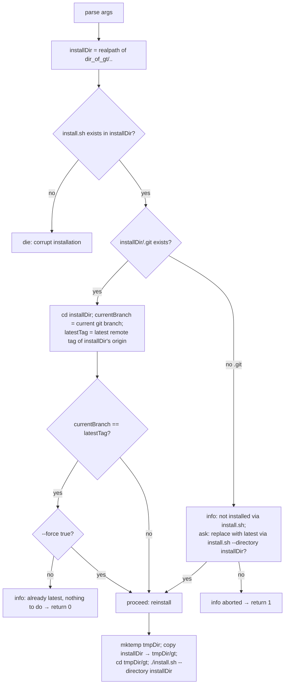

# 09 — `gt self-update` and the automatic update check

## `gt self-update`

Updates the `gt` installation itself by re-running its bundled `install.sh`.

### Parameters

| Pattern | Default | Meaning |
|---------|---------|---------|
| `--force` | `false` | run `install.sh` even if already on the latest tag |

### Workflow

Details:
- `installDir` is the parent of the gt `src` directory (`dir_of_gt/..`).
- A git-based installation (the normal case, since `install.sh` creates a git checkout whose branch is
  the tag name) is considered up-to-date when the checked-out branch equals the latest remote tag.
- For a non-git installation, gt cannot tell the version, so it asks for explicit consent before
  reinstalling.
- The actual update copies the current installation to a temp dir and runs **that** copy's `install.sh`
  with `--directory <installDir>`, so `install.sh` can safely replace `installDir` (it does not delete the
  script that is currently executing). See [11](11-installation.md) for `install.sh` behaviour.

### Exit codes
`0` success (incl. already-latest no-op); `1` user declined / install failed; `9` usage errors.

## Automatic self-update check (`gt_checkForSelfUpdate`)

`pull`, `re-pull`, and `update` call this on success. It is a courtesy reminder, throttled to once every

```mermaid
flowchart TD
    A[on successful pull/re-pull/update] --> B{last check &gt; 15 days ago?<br/>&#40;or no record&#41;}
    B -- no --> done([skip])
    B -- yes --> C[currentVersion = gt.sh --version &#40;last line&#41;]
    C --> D[latestVersion = latest tag of github.com/tegonal/gt]
    D --> E[write today's date to last-update-check.txt]
    E --> F{current != latest?}
    F -- yes --> G[ask: a new version is available, update?]
    G -- yes --> H[run gt_self_update]
    G -- no --> done
    F -- no --> I[info: up-to-date]
```

**15 days** via `<dir_of_gt>/last-update-check.txt` (date `YYYY-mm-dd`).

- The "latest version" is the last entry of `remoteTagsSorted https://github.com/tegonal/gt` (version-
  sorted tags from the canonical gt repo). Note this hard-codes the upstream gt repository URL.
- The 15-day throttle uses the same `doIfLastCheckMoreThanDaysAgo` helper as the GPG re-check (missing
  file ⇒ "last check" treated as `15+60` days ago ⇒ fires).
- Re-implementations MAY make this check configurable/skippable (e.g. for CI), but for parity it should
  exist and be throttled identically. It must never fail the host command (network errors degrade
  gracefully).
