# 10 — Pull Hooks and Placeholders

Two extension mechanisms let consumers and source maintainers customize pulled content: **pull hooks**
(consumer-side, arbitrary Bash) and **placeholders** (maintainer-defined regions a consumer may edit and
`gt update` preserves).

## 1. Pull hooks

A consumer may place a script at `<workingDir>/remotes/<remote>/pull-hook.sh`. If present, `gt pull` (and
therefore `re-pull`, `update`, `reset`) sources it and calls two functions per pulled file:

- `gt_pullHook_<remote>_before <tag> <source> <target>` — before the file is moved to its destination.
- `gt_pullHook_<remote>_after  <tag> <source> <target>` — after the file was moved.

where `<remote>` has every `-` replaced by `_` (e.g. remote `tegonal-scripts` →
`gt_pullHook_tegonal_scripts_before`). Arguments:

1. `tag` — the tag being pulled (`-t`/computed).
2. `source` — absolute path of the fetched file (in `repo`) before the move.
3. `target` — absolute destination path.

```mermaid
sequenceDiagram
    participant P as gt pull (moveFile)
    participant H as pull-hook.sh
    P->>H: gt_pullHook_<remote>_before(tag, source, target)
    alt before hook fails
        H-->>P: non-zero
        P->>P: abort move (returnDying), file NOT moved
    else
        H-->>P: 0
        P->>P: apply placeholders (if hasPlaceholder)
        P->>P: mv source → target
        P->>H: gt_pullHook_<remote>_after(tag, source, target)
        alt after hook fails
            H-->>P: non-zero
            P->>P: report (file already moved; manual cleanup advised)
        end
    end
```

Behaviour:
- A missing hook file ⇒ both hooks are no-ops.
- The hook file is sourced once per pull invocation (it must define both functions).
- A failing **before** hook prevents the move and counts as a failure for that file.
- A failing **after** hook is reported but the file is already in place (the user is told to clean up
  manually).

### Hook example (renaming on pull)

```bash
#!/usr/bin/env bash
set -eu -o pipefail
function gt_pullHook_tegonal_scripts_before(){ : ; }
function gt_pullHook_tegonal_scripts_after(){
  local -r tag=$1 source=$2 target=$3
  if [[ $source =~ .*.txt ]]; then mv "$target" "${target%????}.msg"; fi
}
```

> Re-implementation note: hooks are arbitrary Bash. A non-Bash re-implementation must still be able to
> execute a consumer's `pull-hook.sh` (e.g. by invoking `bash` and calling the named function with the
> three positional args). This is the one place a pure-Rust port must shell out to remain compatible with
> existing consumer projects. The reference also ships helper hook libraries
> (`lib/tegonal-gh-commons/src/gt/pull-hook-functions.sh`) used by gt's own repo, but those are consumer
> assets, not part of gt's core.

## 2. Placeholders

A **source maintainer** can mark regions of a file that consumers are expected to customize and that
`gt update` should not overwrite once edited:

```
... gt-placeholder-<key>-start ...
   (content)
... gt-placeholder-<key>-end ...
```

- A region begins on a line containing `gt-placeholder-<key>-start` and ends on a line containing
  `gt-placeholder-<key>-end`. Both marker lines are part of the region.
- `<key>` is captured by the regex `gt-placeholder-(.*)-start`.

### Detection (`hasGtPlaceholder`)

A file "has placeholders" iff it contains the substring `gt-placeholder` (grep `-q`). The boolean result
is stored in the `hasPlaceholder` column of `pulled.tsv`. (Note: detection is by the literal substring,
so any occurrence — including in `-end` markers or prose — sets the flag.)

### Merge during update (`replaceGtPlaceholdersDuringUpdate`)

Runs only when the existing ledger entry's `hasPlaceholder == true`, before the file is moved into place
(invoked from `pull`'s `moveFile`). Inputs: remote, repo, repo-relative path, current (on-disk) file,
incoming updated file, the old `entryTag`, and the new `tagToPull`.

```mermaid
flowchart TD
    A{entryTag != tagToPull?} -- yes --> B["fetch old tag; show old file;<br/>extract originalPlaceholders (key→block)"]
    A -- no --> C[originalPlaceholders = empty]
    B --> D
    C --> D[extract placeholders from CURRENT on-disk file]
    D --> E[[for each line of the UPDATED incoming file]]
    E --> F{line starts a placeholder region &#40;key&#41;?}
    F -- no --> G[copy line verbatim] --> E
    F -- yes --> H{"current file has this key AND<br/>(key absent in original OR current block != original block)?"}
    H -- yes --> I["consumer edited it → write the CURRENT block;<br/>skip the incoming region body"]
    H -- no --> J[write the incoming region verbatim]
    I --> E
    J --> E
    E --> K[mv merged temp file over updated file]
    K --> L{any current placeholders left unused?}
    L -- yes --> M[WARN: these placeholders no longer exist in the new version]
```



Semantics:
- A placeholder region is **preserved from the consumer's current file** iff the consumer changed it
  relative to the **original** upstream version. If unchanged (or the key didn't exist originally and the
  new version provides it), the **incoming** version's region is used — i.e. upstream updates flow through
  unless the consumer customized that exact region.
- The "original version" is only fetched (old tag checked out via `git show tags/<entryTag>:<path>`) when
  the tag actually changed; when `entryTag == tagToPull` no upstream change is possible so the original is
  treated as empty (optimization).
- Keys present in the consumer's current file but **absent** from the updated version are reported as
  warnings ("placeholder no longer exists").

### Maintainer guidance (from gt's docs)

- Use placeholders for parts you expect consumers to change and don't expect to update upstream.
- If you *do* need to push an update to a placeholder region to all consumers, **rename the key** (e.g.
  `xyz` → `xyz-v2`) so consumers receive the new region (their old-key edit no longer matches and the new
  key flows through).

This placeholder mechanism is the lighter-weight alternative to a pull hook for simple substitutions
(e.g. changing an organization name in a fetched GitHub workflow).
