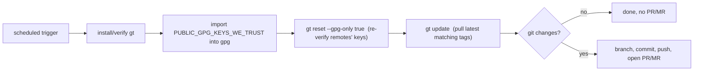

# 12 — CI Integration (GitHub & GitLab)

`gt` ships reusable CI definitions that periodically check for updates to pulled files and to remotes'
public keys, and open a PR/MR with the changes. These are consumer-facing assets fetched via `gt` itself;
they are documented here for completeness but are not part of the `gt` executable's core logic.

## Shared concept



`PUBLIC_GPG_KEYS_WE_TRUST` is an armored export of the public keys the consumer trusts to sign **remotes'
signing keys** (i.e. layer-1 trust, see [03](03-gpg-trust-model.md)). It is imported into the CI runner's
gpg store so that `gt reset`/`gt update` can (re-)establish trust non-interactively.

## GitHub workflow

- Fetched via `gt pull -r gt -p .github/workflows/gt-update.yml -d ./` (after
  `gt remote add -r gt -u https://github.com/tegonal/gt`).
- Runs weekly. Requires repository **variable** `PUBLIC_GPG_KEYS_WE_TRUST`.
- Optional PR controls (consumed by `peter-evans/create-pull-request`):
  - `AUTO_PR_TOKEN` (secret) → `token`.
  - `AUTO_PR_FORK_NAME` (variable, falling back to secret) → `push-to-fork`.
- **Required modification**: a placeholder guards against running in forks:
  ```yml
  # gt-placeholder-owner-start
  if: github.repository_owner == 'tegonal'
  # gt-placeholder-owner-end
  ```
  Consumers replace `tegonal` with their org/user. Because it is a `gt-placeholder`, the edit survives
  `gt update` (see [10](10-pull-hooks-and-placeholders.md)).

## GitLab job

- Fetched via `gt pull -r gt -p src/gitlab/`. Consumer includes
  `include: 'lib/gt/src/gitlab/.gitlab-ci.yml'` and adds a first `gt` stage.
- Defines two job templates:
  - **`.gt-update`** (`gt-update` extends it): image `tegonal/gitlab-git:latest`, runs only when variable
    `$DO_GT_UPDATE` is set. `before_script` installs deps (`bash git gnupg perl coreutils curl`), makes a
    temp dir, clones the current repo, and ensures `~/.local/bin` is on `PATH`. `script` runs
    `install-gt.sh`, `gt reset --gpg-only true`, `gt update`, then `create-mr.sh`.
  - **`.gt-update-stop-pipeline`** (`gt-update-stop-pipeline` extends it): cancels its own job via the
    GitLab API to stop the pipeline after `gt-update`.
- Required configuration:
  - `PUBLIC_GPG_KEYS_WE_TRUST` (used by `install-gt.sh`).
  - `GT_UPDATE_API_TOKEN` (used by `create-mr.sh` to open the MR and by stop-pipeline to cancel).
  - `GITBOT_SSH_PRIVATE_KEY` + a deploy key (required by the `tegonal/gitlab-git` image).
  - A **Scheduled Pipeline** defining `DO_GT_UPDATE=true`.

### `install-gt.sh`
Requires `PUBLIC_GPG_KEYS_WE_TRUST`; imports it into gpg; then runs the embedded `install.doc.sh`
bootstrap (kept in sync by `include-install-doc.sh`). Sets an EXIT trap to clean up its temp dir.

### `create-mr.sh`
Requires `GT_UPDATE_API_TOKEN`, `CI_API_V4_URL`, `CI_PROJECT_ID`. If `git status --porcelain` is empty →
no changes → exit `0`. Otherwise force-creates branch `gt/update`, commits all changes ("Update files
pulled via gt"), force-pushes, and POSTs a merge request (`source_branch=gt/update`, `target_branch=main`,
`remove_source_branch=true`). A `409` with body mentioning "open merge request" is treated as success (MR
already exists and was updated by the force-push); any non-2xx (other than that 409) → error exit `1`.

## `include-install-doc.sh` (maintainer tooling)

A helper used in gt's own repo (and re-usable) that injects the canonical `install.doc.sh` content into
target files between `# see install.doc.sh ... # end install.doc.sh` markers, applying a configurable
indent per target. It escapes `@`, `$`, `\` so the content lands literally. Used to keep the install
instructions identical across the README, the GitHub workflow, and `src/gitlab/install-gt.sh`. Not part of
the runtime `gt` commands.
