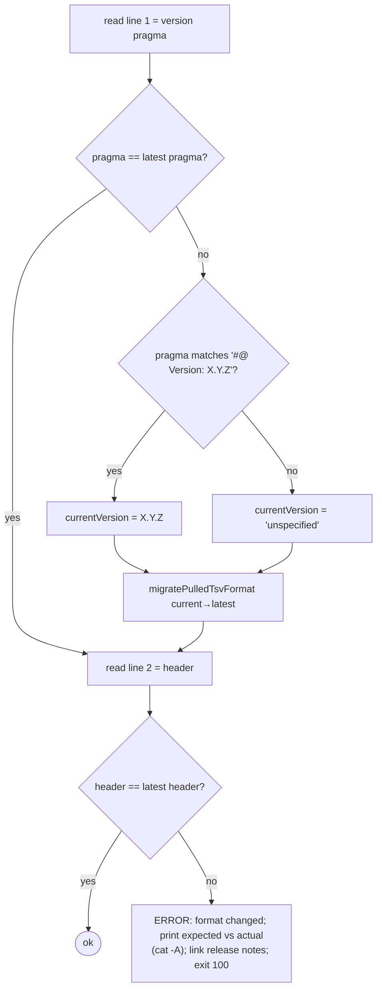

# 13 — `pulled.tsv` Format Versions & Migration

`pulled.tsv` carries a version pragma on line 1. When `gt` reads a `pulled.tsv` whose version is older
than the latest it understands, it **automatically migrates** the file in place (chaining migrations step
by step up to the latest). A re-implementation must implement the same migrations to remain compatible
with consumer projects created by older `gt` versions.

Latest version: **1.2.0**. Latest header: `tag\tfile\trelativeTarget\ttagFilter\thasPlaceholder\tsha512`.
Version pragma format: `#@ Version: <x.y.z>`.

## Detection (`exitIfHeaderOfPulledTsvIsWrong`)

So after migration the header is re-checked; if it still doesn't match the expected header, gt exits
**`100`** (manual intervention needed).

## Version history & migrations (`migratePulledTsvFormat`)

Migrations are applied sequentially; each writes a `pulled.tsv.new`, then atomically `mv`s it over
`pulled.tsv`, then recurses to the next version.

### `unspecified` → `1.0.0`
- An old file with **no** version pragma. Migration: write pragma `#@ Version: 1.0.0`, then append the
  entire existing file unchanged. (Columns at 1.0.0: `tag file relativeTarget sha512` with the original
  header line preserved as the file's own second line.) Then continue to 1.1.0.

### `1.0.0` → `1.1.0`  (adds `tagFilter`)
- New header: `tag\tfile\trelativeTarget\ttagFilter\tsha512`.
- For each data row (from line 3 on), read `tag file relativeTarget sha512` and rewrite inserting
  `tagFilter = .*` before the sha column.

### `1.1.0` → `1.2.0`  (adds `hasPlaceholder`)
- New header: `tag\tfile\trelativeTarget\ttagFilter\thasPlaceholder\tsha512`.
- For each data row, read `tag file relativeTarget tagFilter sha512`, compute
  `hasPlaceholder = hasGtPlaceholder(<workingDir>/<relativeTarget>)` (does the on-disk file contain the
  substring `gt-placeholder`?), and rewrite with the new column inserted before sha.

### Unknown / newer
- If `fromVersion` is none of the above, `die` instructing the user to check the release notes for
  migration hints (links `…/releases/tag/<GT_VERSION>`). (This also covers a `pulled.tsv` produced by a
  **newer** gt than the one reading it.)

## Column evolution summary

| Version | Columns |
|---------|---------|
| 1.0.0 | `tag`, `file`, `relativeTarget`, `sha512` |
| 1.1.0 | + `tagFilter` (default `.*`) |
| 1.2.0 | + `hasPlaceholder` (computed from file content) |

## Implementation requirements

- Reading any supported version MUST transparently migrate to 1.2.0 and persist the migrated file (the
  reference rewrites the file on disk during read).
- Writing always uses 1.2.0.
- The migration is destructive-in-place but proceeds via a `.new` temp file + atomic rename per step, so a
  crash mid-migration leaves either the old or the new file intact.
- The header equality check is exact (including tab separators); `cat -A`-style diagnostics help users see
  whitespace differences.
