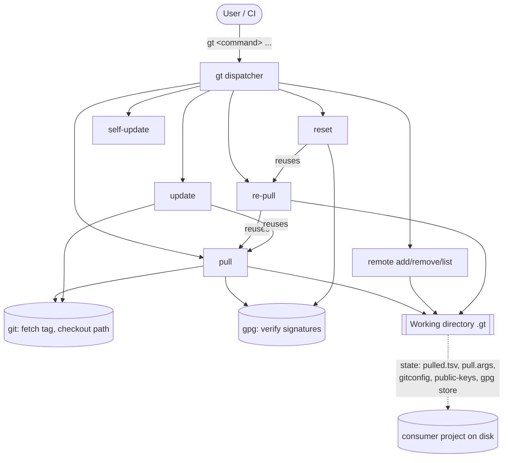

# gt — Specification

This directory contains a complete, implementation-independent specification of the `gt`
(**g**(it)**t**(ools)) command line tool, reverse-engineered from the reference Bash implementation in
[`../src`](../src) and the user documentation in [`../README.md`](../README.md).

The goal of this specification is to contain **all** information required to re-implement `gt` in a
different language (e.g. Rust) with behaviour equivalent to the reference implementation. It covers the
current feature set of `gt` and nothing more.

> Reference implementation version at time of writing: **v1.7.0-SNAPSHOT**
> (the released line is v1.6.x; `pulled.tsv` format version **1.2.0**).

## What gt does (in one paragraph)

`gt` pulls individual files or directories out of a git repository at a specific git **tag**, verifies
their authenticity and integrity with **GPG signatures**, and places them anywhere in the consuming
project. It records what was pulled so the files can be re-fetched (`re-pull`), upgraded/downgraded
(`update`), and re-trusted (`reset`). It behaves like a minimal, dependency-resolution-free package
manager built on top of git repositories. It is **not** intended to push changes back.

## Reading order

| # | File | Contents |
|---|------|----------|
| — | [README.md](README.md) | This index, glossary, high-level architecture |
| 01 | [01-concepts-and-data-model.md](01-concepts-and-data-model.md) | Working directory layout, all on-disk file formats (`pulled.tsv`, `pull.args`, `gitconfig`, GPG stores) |
| 02 | [02-cli-and-argument-parsing.md](02-cli-and-argument-parsing.md) | Command dispatch, argument parsing semantics, `--help`/`--version`, exit codes, logging |
| 03 | [03-gpg-trust-model.md](03-gpg-trust-model.md) | The whole trust/verification model: key import, expiration, revocation, periodic re-check |
| 04 | [04-command-remote.md](04-command-remote.md) | `gt remote add` / `remove` / `list` |
| 05 | [05-command-pull.md](05-command-pull.md) | `gt pull` — the central workflow |
| 06 | [06-command-re-pull.md](06-command-re-pull.md) | `gt re-pull` |
| 07 | [07-command-reset.md](07-command-reset.md) | `gt reset` |
| 08 | [08-command-update.md](08-command-update.md) | `gt update` |
| 09 | [09-command-self-update.md](09-command-self-update.md) | `gt self-update` and the automatic update check |
| 10 | [10-pull-hooks-and-placeholders.md](10-pull-hooks-and-placeholders.md) | Pull hooks and `gt-placeholder` substitution |
| 11 | [11-installation.md](11-installation.md) | `install.sh` behaviour |
| 12 | [12-ci-integration.md](12-ci-integration.md) | GitHub workflow & GitLab job templates |
| 13 | [13-pulled-tsv-migrations.md](13-pulled-tsv-migrations.md) | `pulled.tsv` format versions and automatic migration |
| 14 | [14-dependencies-and-environment.md](14-dependencies-and-environment.md) | External programs, environment, platform assumptions |

## High-level architecture

`gt` is composed of a thin dispatcher (`gt.sh`) and one script per command. `re-pull`, `update` and
`reset` are built **on top of** the `pull` machinery — they compute a list of (tag, path, target) tuples
from `pulled.tsv` and feed each one through the same internal pull routine that `pull` uses. A
re-implementation should mirror this layering: implement `pull` first, then express the others in terms
of it.

## Glossary

- **Remote** — a named reference to a git repository URL from which files are pulled. Identified by a
  name matching `^[a-zA-Z0-9_-]+$`. Stored under `<workingDir>/remotes/<remote>/`.
- **Working directory** (`workingDir`) — the directory in which `gt` keeps all its state. Default `.gt`,
  overridable per invocation with `-w|--working-directory`. Must reside inside the current directory.
- **Pull directory** (`pullDir`) — the directory into which pulled files are written. Default
  `lib/<remote>`, configurable per remote and per pull.
- **`pulled.tsv`** — per-remote ledger of every file pulled from that remote (tag, source path, target
  location, tag filter, placeholder flag, sha512). Drives `re-pull` and `update`.
- **`pull.args`** — per-remote file of default `gt pull` arguments, applied automatically on every pull
  for that remote.
- **Tag filter** — a `grep -E` regex used to restrict which tags are considered when determining the
  "latest" tag.
- **Signing key** — `signing-key.public.asc`, the GPG public key a remote publishes (in its `.gt/`
  directory) to sign released files.
- **Placeholder** — a `gt-placeholder-<key>-start` … `gt-placeholder-<key>-end` marked region in a
  pulled file that a consumer may edit and that `gt update` then leaves untouched.
- **Pull hook** — optional consumer-supplied Bash functions run before/after each file is moved into
  place.

## Conventions used in this spec

- "MUST", "SHOULD", "MAY" are used in their usual RFC-2119 sense.
- File paths in code font are relative to the consumer project root unless stated otherwise.
- `<remote>` denotes the remote name; `<workingDir>` the working directory (default `.gt`).
- Where the reference implementation's exact exit code or message matters for compatibility, it is
  called out explicitly. Exact wording of human-readable log messages is **not** normative unless noted;
  exit codes and machine-readable file formats **are** normative.
