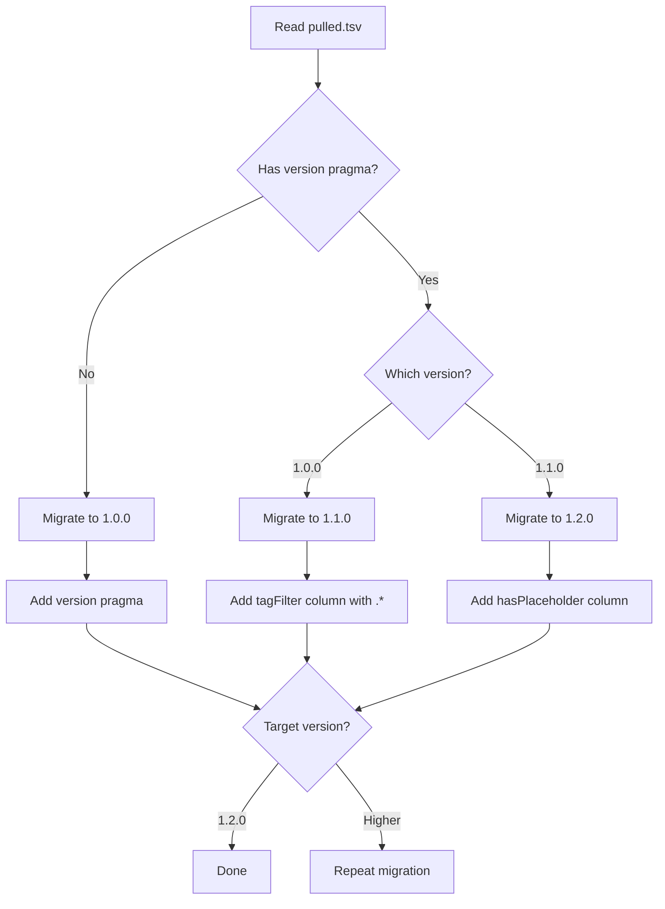

# gt - Internal Utilities - Specification

## Overview

This document describes the internal utility functions and data structures used by the gt tool.

---

## Data Structures

### pulled.tsv Format

```
#@ Version: 1.2.0
tag	file	relativeTarget	tagFilter	hasPlaceholder	sha512
v1.0.0	src/script.sh	lib/scripts/script.sh	.*	false	a1b2c3...
```

**Format Versions:**
- `1.0.0`: Initial format (tag, file, relativeTarget, sha512)
- `1.1.0`: Added tagFilter column
- `1.2.0`: Added hasPlaceholder column

### Migration Process



---

## Utility Functions

### pulled-utils.sh

#### `pulledTsvEntry`

Creates a TSV entry for a pulled file:

```bash
function pulledTsvEntry() {
    tag file relativeTarget tagFilter hasPlaceholder sha512
    printf "%s\t" "$tag" "$file" "$relativeTarget" "$tagFilter" "$hasPlaceholder"
    printf "%s\n" "$sha512"
}
```

#### `migratePulledTsvFormat`

Migrates pulled.tsv between versions:

```bash
function migratePulledTsvFormat() {
    workingDirAbsolute pulledTsv fromVersion toVersion
    
    case $fromVersion in
        "unspecified")
            # Add version pragma 1.0.0
            migratePulledTsvFormat "$workingDirAbsolute" "$pulledTsv" "1.0.0" "$toVersion"
            ;;
        "1.0.0")
            # Add tagFilter column
            migratePulledTsvFormat "$workingDirAbsolute" "$pulledTsv" "1.1.0" "$toVersion"
            ;;
        "1.1.0")
            # Add hasPlaceholder column
            # Done
            ;;
        *)
            die "no automatic migration available"
            ;;
    esac
}
```

#### `exitIfHeaderOfPulledTsvIsWrong`

Validates and migrates pulled.tsv if needed:

```bash
function exitIfHeaderOfPulledTsvIsWrong() {
    workingDirAbsolute pulledTsv
    
    currentVersionPragma=$(head -n 1 "$pulledTsv")
    currentHeader=$(head -n 2 "$pulledTsv" | tail -n 1)
    
    if [[ $currentVersionPragma != "$pulledTsvLatestVersionPragma" ]]; then
        migratePulledTsvFormat "$workingDirAbsolute" "$pulledTsv" "$currentVersion" "$pulledTsvLatestVersion"
    fi
    
    if [[ $currentHeader != "$pulledTsvHeader" ]]; then
        die "header mismatch, check release notes"
    fi
}
```

#### `setEntryVariables`

Parses a TSV entry into variables:

```bash
function setEntryVariables() {
    entryTag entryFile entryRelativePath entryTagFilter entryHasPlaceholder entrySha
    IFS=$'\t' read -r "${variableNames[@]}" <<<"$1"
}
```

#### `grepPulledEntryByFile`

Finds entry for a specific file:

```bash
function grepPulledEntryByFile() {
    pulledTsv file
    
    # Escape special regex characters in filename
    escapedFile=$(printf '%s\n' "$file" | sed -e 's/[.[\*^$()+?{}|\\]/\\&/g')
    grep -E "^[^	]+	$escapedFile" "$pulledTsv"
}
```

#### `replacePulledEntry`

Replaces an entry in pulled.tsv:

```bash
function replacePulledEntry() {
    pulledTsv file entry
    
    # Remove old entry
    grepPulledEntryByFile "$pulledTsv" "$file" -v >"$pulledTsv.new"
    
    # Add new entry
    echo "$entry" >>"$pulledTsv.new"
    
    # Replace original
    mv "$pulledTsv.new" "$pulledTsv"
}
```

#### `readPulledTsv`

Iterates over all entries in pulled.tsv:

```bash
function readPulledTsv() {
    workingDirAbsolute remote callback fileDescriptorOut fileDescriptorIn
    
    # Skip version pragma and header (first 2 lines)
    tail -n +3 "$pulledTsv" >&$fileDescriptorOut
    
    while read -u "$fileDescriptorIn" -r entry; do
        setEntryVariables "$entry"
        localAbsolutePath=$(readlink -m "$workingDirAbsolute/$entryRelativePath")
        "$callback" "$entryTag" "$entryFile" "$entryRelativePath" \
            "$localAbsolutePath" "$entryTagFilter" "$entryHasPlaceholder" "$entrySha"
    done
}
```

#### `hasGtPlaceholder`

Checks if a file contains GT placeholders:

```bash
function hasGtPlaceholder() {
    file
    grep -q "gt-placeholder" "$file" && echo "true" || echo "false"
}
```

#### `replaceGtPlaceholdersDuringUpdate`

Preserves user modifications in placeholders during updates:

```bash
function replaceGtPlaceholdersDuringUpdate() {
    remote repo repoPath currentFile updatedFile entryTag tagToPull
    
    # Extract placeholders from original tag
    if [[ $entryTag != "$tagToPull" ]]; then
        gitFetchTagFromRemote "$remote" "$repo" "$entryTag"
        originalFile=$(git -C "$repo" --no-pager show "tags/$entryTag:$repoPath")
        extractPlaceholders originalPlaceholders <<<"$originalFile"
    fi
    
    # Extract placeholders from current file
    extractPlaceholders placeholders <"$currentFile"
    
    # Merge: keep user modifications, use remote for unchanged
    while IFS= read -r line; do
        if [[ $line =~ gt-placeholder-(.*)-start ]]; then
            key="${BASH_REMATCH[1]}"
            if [[ -v placeholders[$key] ]] && [[ ! -v originalPlaceholders[$key] || 
                "${placeholders[$key]}" != "${originalPlaceholders[$key]}" ]]; then
                # User modified, keep their version
                printf "%s" "${placeholders[$key]}"
            else
                # Not modified, use remote version
                echo "$line"
            fi
        else
            echo "$line"
        fi
    done <"$updatedFile"
}
```

---

## Path Constants (paths.source.sh)

All paths are relative to `$workingDirAbsolute`:

| Variable | Path | Description |
|----------|------|-------------|
| `remotesDir` | `$workingDirAbsolute/remotes` | Directory containing remotes |
| `remoteDir` | `$remotesDir/$remote` | Directory for specific remote |
| `publicKeysDir` | `$remoteDir/public-keys` | GPG public keys |
| `repo` | `$remoteDir/repo` | Git clone of remote |
| `gpgDir` | `$publicKeysDir/gpg` | GPG home directory |
| `pulledTsv` | `$remoteDir/pulled.tsv` | Pulled files list |
| `pullArgsFile` | `$remoteDir/pull.args` | Stored pull arguments |
| `pullHookFile` | `$remoteDir/pull-hook.sh` | Pull hook script |
| `gitconfig` | `$remoteDir/gitconfig` | Backup of git config |
| `lastSigningKeyCheckFile` | `$gpgDir/signing-key.last-check.txt` | Last key revocation check |

---

## Common Constants (common-constants.source.sh)

### Parameter Patterns

| Constant | Pattern | Description |
|----------|---------|-------------|
| `remoteParamPattern` | `-r|--remote` | Remote name parameter |
| `workingDirParamPattern` | `-w|--working-directory` | Working directory parameter |
| `pullDirParamPattern` | `-d|--directory` | Pull directory parameter |
| `tagParamPattern` | `-t|--tag` | Git tag parameter |
| `tagFilterParamPattern` | `--tag-filter` | Tag filter regex parameter |
| `pathParamPattern` | `-p|--path` | File path parameter |
| `chopPathParamPattern` | `--chop-path` | Strip path structure parameter |
| `targetFileNamePattern` | `--target-file-name` | Rename file parameter |
| `autoTrustParamPattern` | `--auto-trust` | Auto-trust GPG parameter |
| `unsecureParamPattern` | `--unsecure` | Skip GPG requirement parameter |
| `unsecureNoVerificationParamPattern` | `--unsecure-no-verification` | Skip all verification |
| `gpgOnlyParamPattern` | `--gpg-only` | GPG-only reset parameter |
| `listParamPattern` | `--list` | List updates parameter |

### Default Values

| Constant | Value | Description |
|----------|-------|-------------|
| `defaultWorkingDir` | `.gt` | Default working directory |
| `pulledTsvLatestVersion` | `1.2.0` | Latest pulled.tsv format version |
| `pulledTsvLatestVersionPragma` | `#@ Version: 1.2.0` | Version pragma |
| `pulledTsvHeader` | `tag\tfile\trelativeTarget\ttagFilter\thasPlaceholder\tsha512` | TSV header |
| `signingKeyAsc` | `signing-key.public.asc` | Signing key filename |
| `fakeTag` | `NOT_A_REAL_TAG_JUST_TEMPORARY` | Placeholder for "use latest" |

---

## External Dependencies

### tegonal/scripts Utilities

| Module | Functions |
|--------|-----------|
| `parse-args.sh` | `parseArguments`, `exitIfNotAllArgumentsSet`, `exitIfArgIsNotBoolean` |
| `parse-commands.sh` | `parseCommands` |
| `parse-fn-args.sh` | `parseFnArgs`, `exitIfVariablesNotDeclared` |
| `gpg-utils.sh` | `initialiseGpgDir`, `validateSigningKeyAndImport`, `getSigningGpgKeyData` |
| `git-utils.sh` | `currentGitBranch`, `latestRemoteTag`, `hasRemoteTag`, `remoteTagsSorted` |
| `io.sh` | `withCustomOutputInput`, `deleteDirChmod777` |
| `ask.sh` | `askYesOrNo` |
| `checks.sh` | `exitIfArgIsNotArrayOrIsNonEmpty`, `exitIfArgIsNotFunction` |
| `date-utils.sh` | `timestampInMs`, `elapsedSecondsBasedOnTimestampInMs`, `doIfLastCheckMoreThanDaysAgo` |

---

## Error Handling Patterns

### Cleanup on Exit

```bash
function gt_pull_cleanupRepo() {
    repository
    if [[ -d $repository ]]; then
        find "$repository" -maxdepth 1 -type d -not -path "$repository" -not -name ".git" \
            -exec rm -r {} \;
    fi
}

trap "gt_pull_cleanupRepo '$repo'" EXIT
```

### Callback Counters

```bash
function gt_remote_importKeyCallback() {
    ((++numberOfImportedKeys))
}

importRemotesPulledSigningKey "$workingDirAbsolute" "$remote" gt_remote_importKeyCallback
```

### File Descriptor Usage

```bash
# Custom file descriptors for piping
function gt_re_pull_allRemotes() {
    gt_remote_list_raw -w "$workingDirAbsolute" >&7
    while read -u 8 -r remote; do
        gt_re_pull_rePullRemote "$remote"
    done
}

withCustomOutputInput 7 8 gt_re_pull_allRemotes
```

---

## Regular Expressions

### Remote Name Validation

```bash
remoteIdentifierRegex="^[a-zA-Z0-9_-]+$"
```

### Version Pragmas

```bash
versionRegex="#@ Version: ([0-9]\.[0-9]\.[0-9])"
```

### Placeholder Detection

```bash
gtPlaceholderRegex="gt-placeholder-(.*)-start"
```

### Tag Filter (default)

```bash
.*  # Matches all tags
```

---

## Security Considerations

### Path Validation

```bash
# Check paths are inside current directory
exitIfPathNamedIsOutsideOf "$workingDir" "working directory" "$currentDir"
checkPathNamedIsInsideOf "$pullDirAbsolute" "pull directory" "$currentDir"
```

### GPG Key Revocation

```bash
# Check every 30 days
doIfLastCheckMoreThanDaysAgo 30 "$lastSigningKeyCheckFile" gt_pull_resetEachMonth_callback
```

### Signature Verification

```bash
# Verify signature
gpg --homedir "$gpgDir" --verify "$sigFile" "$absoluteFile"

# Check key revocation
keyData=$(getSigningGpgKeyData "$sigFile" "$gpgDir")
isGpgKeyInKeyDataRevoked "$keyData"
```
