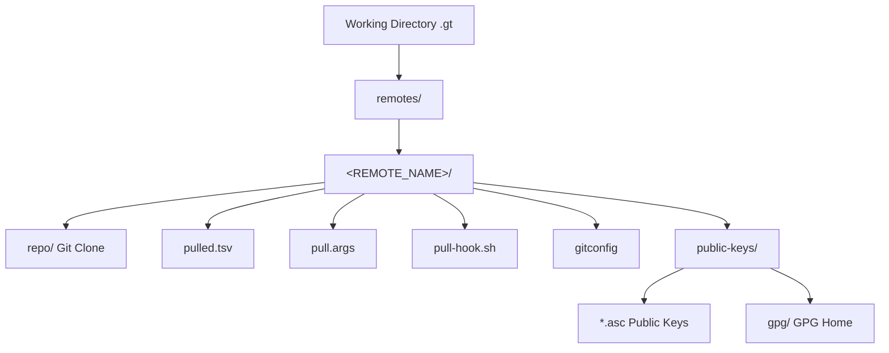
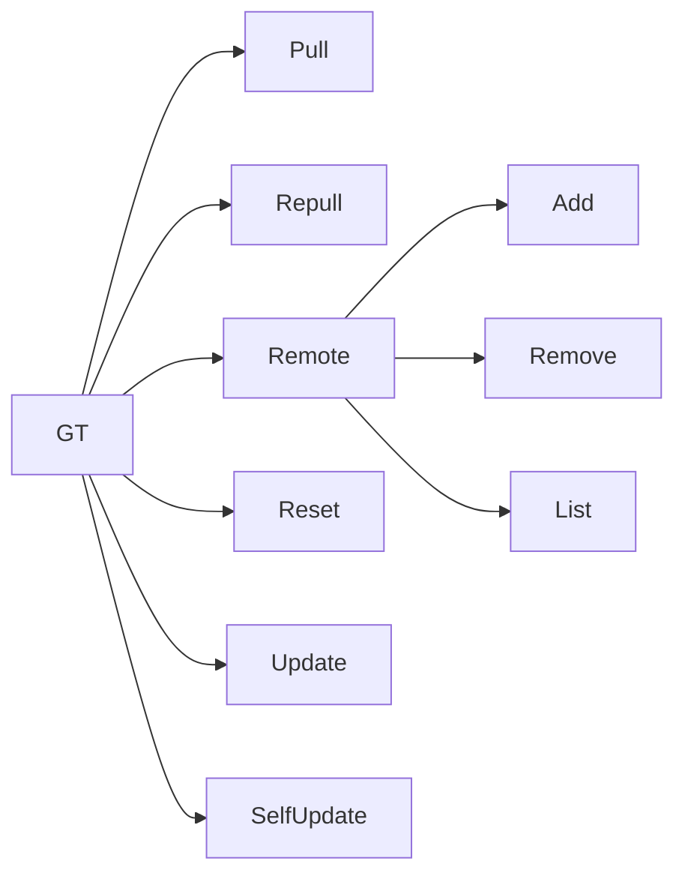

# gt (g(it)t(ools)) - Specification

## Overview

`gt` is a Bash-based tool that pulls files or directories from Git repositories with automatic GPG verification. It enables maintaining files (scripts, config files, etc.) at a single place and pulling them into multiple projects.

### Key Characteristics

- **Language**: Bash 5+ (requires `shopt -s inherit_errexit`)
- **Purpose**: Git-based file distribution with integrity verification
- **Similar to**: A lightweight package manager based on Git without dependency resolution

### Core Concepts

1. **Remotes**: Named Git repositories from which files can be pulled
2. **Pull Directory**: Local directory where files are stored
3. **Working Directory**: `.gt` by default, stores configuration and state
4. **GPG Verification**: All pulled files are verified against GPG signatures
5. **Tags**: Files are pulled from specific Git tags (not branches)

---

## Directory Structure

```
<WORKING_DIR>/               # Default: .gt
├── remotes/
│   ├── <REMOTE_NAME>/
│   │   ├── repo/                    # Git clone of the remote
│   │   ├── public-keys/
│   │   │   ├── *.asc               # Public GPG keys
│   │   │   └── gpg/                # GPG home directory
│   │   ├── pulled.tsv              # List of pulled files
│   │   ├── pull.args               # Stored pull arguments
│   │   ├── pull-hook.sh            # Optional hook script
│   │   └── gitconfig               # Backup of remote's gitconfig
│   └── ...
└── ...
```

### Directory Structure Mermaid Diagram



---

## Data Structures

### pulled.tsv Format

Tab-separated file tracking pulled files:

```
#@ Version: 1.2.0
tag	file	relativeTarget	tagFilter	hasPlaceholder	sha512
<tag>	<file_path>	<local_path>	<tag_filter_regex>	<true|false>	<sha512_hash>
```

**Columns:**
1. `tag`: Git tag version from which the file was pulled
2. `file`: Path of the file in the remote repository
3. `relativeTarget`: Path relative to working directory where file is stored
4. `tagFilter`: Regex pattern for filtering tags during updates
5. `hasPlaceholder`: `true` if file contains GT placeholders, `false` otherwise
6. `sha512`: SHA-512 hash of the file content

### pull.args Format

Stores pre-defined arguments which is passed to `gt pull`. Arguments specified by the user take precedence.

## Commands

### Command Hierarchy



---

## Configuration Constants

| Constant | Default | Description |
|----------|---------|-------------|
| `defaultWorkingDir` | `.gt` | Default working directory for gt state |
| `pulledTsvLatestVersion` | `1.2.0` | Current pulled.tsv format version |
| `signingKeyAsc` | `signing-key.public.asc` | Filename for remote's public GPG key |
| `fakeTag` | `NOT_A_REAL_TAG_JUST_TEMPORARY` | Placeholder when tag is omitted (use latest) |

---

## Placeholder System

Files can contain placeholders that allow users to customize content without losing it during updates:

```
# gt-placeholder-myconfig-start
# User-specific configuration
ORG_NAME=mycompany
# gt-placeholder-myconfig-end
```

**Behavior:**
- Placeholders are detected during `gt pull` and `gt update`
- Content within placeholders is preserved across updates
- If a placeholder no longer exists in the remote, a warning is issued
- Renaming placeholders (e.g., `myconfig-v2`) forces a fresh pull

---

## Security Model

1. **GPG Verification**: All files are signed and verified
2. **Key Trust**: Public keys from `.gt/.gt/signing-key.public.asc` verify remote keys
3. **Key Revocation Check**: Signing keys are checked for revocation every 30 days
4. **Signature Files**: Each file has a corresponding `.sig` file

---

## Exit Codes

| Code | Meaning |
|------|---------|
| 0 | Success |
| 1 | General error |
| 9 | User cancelled operation |
| 10 | User aborted (pull hook warning) |
| 99 | Help displayed |
| 100 | pulled.tsv header mismatch |

---

## Dependencies

- **Bash**: Version 5+ (requires `inherit_errexit`)
- **Git**: For repository operations
- **GPG**: For signature verification
- **Coreutils**: For file operations
- **tegonal/scripts**: Utility libraries (parse-args, parse-commands, gpg-utils, etc.)
