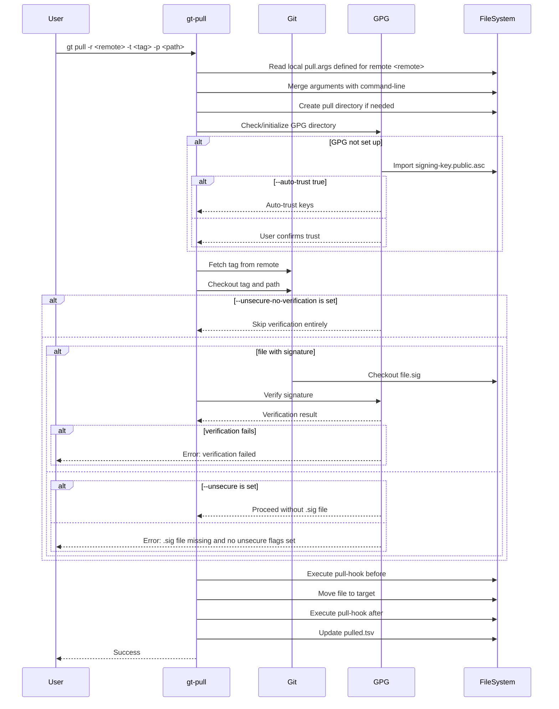
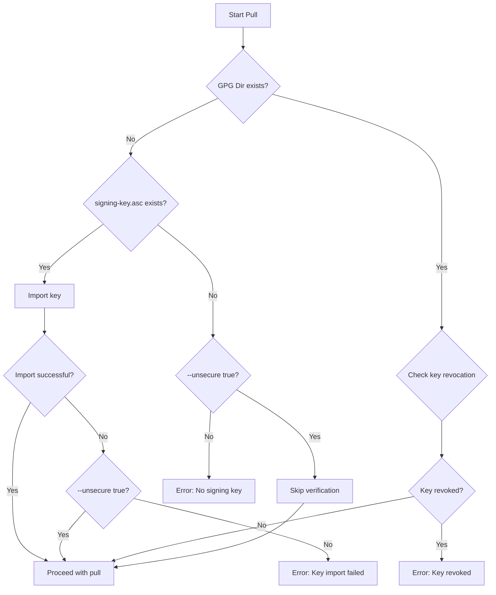
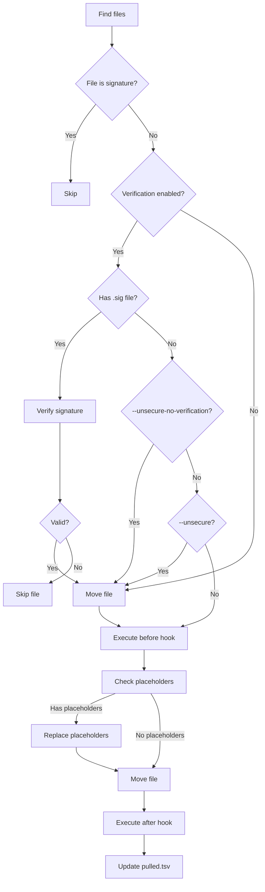
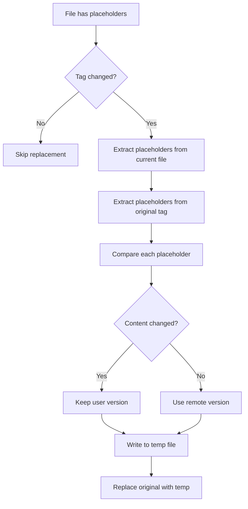

# gt pull - Specification

## Overview

The `gt pull` command pulls files or directories from a configured remote repository at a specific tag, with GPG verification.


## Pull Workflow



---

## Detailed Workflow Steps

### 1. Argument Parsing

Arguments are parsed in two phases:

1. **First parse**: Extract `workingDir` and `remote` to locate `pull.args`
2. **Second parse**: Merge stored arguments with command-line arguments

```bash
# Read stored arguments from pull.args
while read -r line; do
    eval 'args+=('"$line"');'
done <"$pullArgsFile"

# Parse with merged arguments
parseArguments params "$examples" "$GT_VERSION" "${args[@]}"
```

### 2. GPG Setup



### 3. File Checkout

1. Fetch the specified tag from remote:
   ```bash
   gitFetchTagFromRemote "$remote" "$repo" "$tagToPull"
   ```

2. Checkout the file/directory:
   ```bash
   git -C "$repo" checkout "tags/$tagToPull" -- "$path"
   ```

3. For files, also fetch signature:
   ```bash
   git -C "$repo" checkout "tags/$tagToPull" -- "$path.sig"
   ```

### 4. Verification

For each file:

```bash
if [[ $doVerification == true ]]; then
    if [[ -f "$sigFile" ]]; then
        gpg --homedir "$gpgDir" --verify "$sigFile" "$absoluteFile"
        
        # Check for key revocation
        keyData=$(getSigningGpgKeyData "$sigFile" "$gpgDir")
        keyId=$(extractGpgKeyIdFromKeyData "$keyData")
        isGpgKeyInKeyDataRevoked "$keyData"
    else
        if [[ $unsecureNoVerification == true ]]; then
            # Skip verification entirely
            echo "Skipping verification due to --unsecure-no-verification"
        elif [[ $unsecure == true ]]; then
            # Proceed without .sig file
            echo "Proceeding without .sig file due to --unsecure"
        else
            # Error: .sig file missing and no unsecure flags set
            echo "Error: .sig file missing and no unsecure flags set"
            exit 1
        fi
    fi
fi
```

### 5. File Processing

For each file found in the checkout:



### 6. pulled.tsv Update

Entry format:
```
<tag>\t<file>\t<relativeTarget>\t<tagFilter>\t<hasPlaceholder>\t<sha512>
```

Logic:
- **New file**: Append entry
- **Existing file, different tag**: Replace entry, warn
- **Existing file, same tag, different SHA**: Warn and skip
- **Existing file, same tag, same SHA**: Overwrite

---

## Pull Hooks

### Before Hook

Executed before moving file to target:

```bash
function gt_pullHook_<REMOTE>_before() {
    local -r tag=$1 source=$2 target=$3
    # Modify source file before move
}
```

### After Hook

Executed after moving file to target:

```bash
function gt_pullHook_<REMOTE>_after() {
    local -r tag=$1 source=$2 target=$3
    # Modify target file after move
}
```

### Hook Location

`.gt/remotes/<REMOTE>/pull-hook.sh`

---

## Placeholder Replacement

When updating files with placeholders:



---

## Examples

```bash
# Pull specific file at specific tag
gt pull -r tegonal-scripts -t v0.1.0 -p src/utility/update-bash-docu.sh

# Pull directory
gt pull -r tegonal-scripts -t v0.1.0 -p src/utility/

# Pull with custom directory, chop path
gt pull -r tegonal-scripts -t v0.1.0 -d .github --chop-path true -p .github/CODE_OF_CONDUCT.md

# Pull latest version with tag filter
gt pull -r tegonal-scripts -p src/utility/checks.sh --tag-filter "^v3.*"

# Auto-trust GPG keys
gt pull -r tegonal-scripts --auto-trust true -p src/utility/checks.sh

# Pull without GPG verification
gt pull -r tegonal-scripts --unsecure true -p src/utility/checks.sh

# Rename file during pull
gt pull -r tegonal-scripts -p src/utility/ask.sh --target-file-name asking.sh
```

---

## Verification States

| State | doVerification | Description |
|-------|----------------|-------------|
| Full verification | `true` | Verify signatures, check key revocation |
| Unsecure | `false` | Skip verification, no GPG setup required |
| Unsecure-no-verification | `false` | Skip verification even if GPG is available |

---

## Error Handling

| Error Condition | Exit Code | Message |
|-----------------|-----------|---------|
| Working directory missing | 1 | Exit if working directory does not exist |
| Remote not found | 1 | Remote directory does not exist |
| Path outside current dir | 1 | Target path is outside current directory |
| No signature file | 1 | File has no .sig (unless --unsecure) |
| GPG verification failed | 1 | Signature verification failed |
| Key revoked | 1 | Signing key has been revoked |
| Checkout failed | 1 | Tag or path does not exist |
| Pull hook failed | 1 | Before/after hook returned error |

---

## Performance Considerations

1. **Git checkout**: Only fetches requested tag, not entire history
2. **Signature verification**: Per-file GPG verification
3. **Placeholder detection**: Single grep per file
4. **SHA calculation**: SHA-512 computed once per file

---

## Side Effects

1. Creates pull directory structure
2. Initializes GPG directory (if needed)
3. Updates `pulled.tsv`
4. Moves files from temp location to target
5. Executes pull hooks
