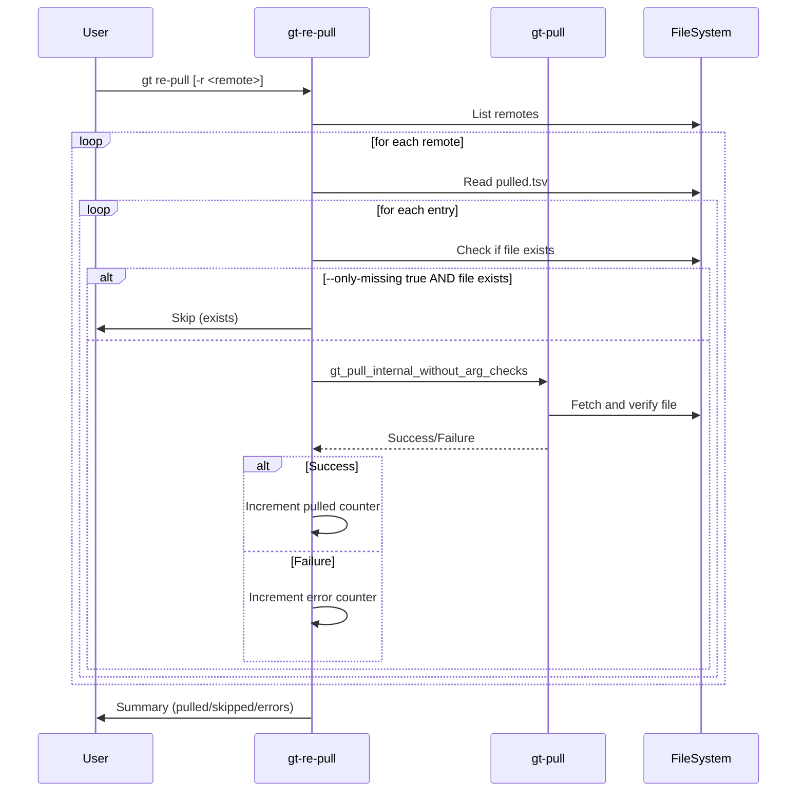

# gt re-pull - Specification

## Overview

The `gt re-pull` command re-fetches files defined in `pulled.tsv` for a specific remote or all remotes. It's used to restore missing files or re-fetch all files.

## Workflow



---

## Processing Logic

### Per-Remote Processing

```bash
function gt_re_pull_rePullInternal() {
    # Parse pull arguments for the remote
    gt_pull_parse_args gt_pull_parsed_args "$currentDir" \
        "$workingDirParamPatternLong" "$workingDirAbsolute" \
        "$remoteParamPatternLong" "$remote" \
        ...
    
    # Read pulled.tsv and process each entry
    readPulledTsv "$workingDirAbsolute" "$remote" gt_re_pull_rePullInternal_callback 5 6
}
```

### Per-Entry Callback

```bash
function gt_re_pull_rePullInternal_callback() {
    # Extract entry data
    entryTag entryFile entryRelativePath entryAbsolutePath entryTagFilter _hasPlaceholder _entrySha512
    
    # Determine target directory and filename
    entryTargetFileName=$(basename "$entryRelativePath")
    parentDir=$(dirname "$entryAbsolutePath")
    
    # Check if file should be pulled
    if [[ $onlyMissing == false ]] || ! [[ -f $entryAbsolutePath ]]; then
        # Prepare arguments for gt_pull_internal_without_arg_checks
        gt_pull_parsed_args[2]=$entryTag      # tag
        gt_pull_parsed_args[3]=$entryFile     # path
        gt_pull_parsed_args[4]=$parentDir     # directory
        gt_pull_parsed_args[6]=$entryTargetFileName  # target-file-name
        gt_pull_parsed_args[7]=$entryTagFilter       # tag-filter
        
        # Execute pull
        gt_pull_internal_without_arg_checks "$currentDir" "$startTimestampInMs" "${gt_pull_parsed_args[@]}"
    else
        # Skip existing file
        ((++skipped))
    fi
}
```

---

## Argument Inheritance

When re-pulling, the original pull arguments are preserved:

```bash
# These are taken from the pulled.tsv entry:
- tag (entryTag)
- path (entryFile)
- tagFilter (entryTagFilter)

# These are computed from the entry:
- directory (parentDir of entryRelativePath)
- target-file-name (basename of entryRelativePath)

# These are inherited from the remote's pull.args specified in .gt/remotes/<remote>/pull.args:
- chop-path (always true for re-pull)
- auto-trust, unsecure, etc.
```

---

## Output Summary

```
<pulled> files re-pulled in <seconds> seconds, <skipped> skipped
```

If skipped > 0 and `--only-missing true`:
```
In case you want to re-fetch also existing files, then use: --only-missing false
```

---

## Examples

```bash
# Re-pull missing files for all remotes
gt re-pull

# Re-pull missing files for specific remote
gt re-pull -r tegonal-scripts

# Re-pull all files (including existing ones)
gt re-pull -r tegonal-scripts --only-missing false

# Re-pull with auto-trust
gt re-pull -r tegonal-scripts --auto-trust true

# Custom working directory
gt re-pull -w .github/.gt -r tegonal-scripts
```

---

## State Tracking

| Counter | Description |
|---------|-------------|
| `pulled` | Files successfully re-fetched |
| `skipped` | Files skipped (already exist) |
| `errors` | Files that failed to pull |

---

## Error Handling

| Error Condition | Behavior |
|-----------------|----------|
| Remote not found | Log warning, skip remote |
| pulled.tsv missing | Log warning, skip remote |
| File pull fails | Increment error counter, continue |
| GPG verification fails | File not pulled, error counted |

---

## Relationship to gt pull

`gt re-pull` internally uses `gt_pull_internal_without_arg_checks`:

```
gt re-pull
  └─> gt_pull_parse_args (parse stored arguments)
      └─> gt_pull_internal_without_arg_checks (actual pull)
```

This ensures consistent behavior between initial pull and re-pull.

---

## Differences from gt update

| Feature | gt re-pull | gt update |
|---------|------------|-----------|
| Tag handling | Uses original tag | Updates to latest tag |
| Purpose | Restore missing files | Update to new versions |
| Tag filter | Uses original filter | Uses original filter |
| Default | Missing files only | All files |

---

## Implementation Notes

### File Descriptor Usage

```bash
# Custom file descriptors for reading pulled.tsv
withCustomOutputInput 5 6 gt_re_pull_rePullInternal "$remote"
```

### Remote Iteration

```bash
function gt_re_pull_allRemotes() {
    gt_remote_list_raw -w "$workingDirAbsolute" >&7
    while read -u 8 -r remote; do
        gt_re_pull_rePullRemote "$remote"
    done
}
```
