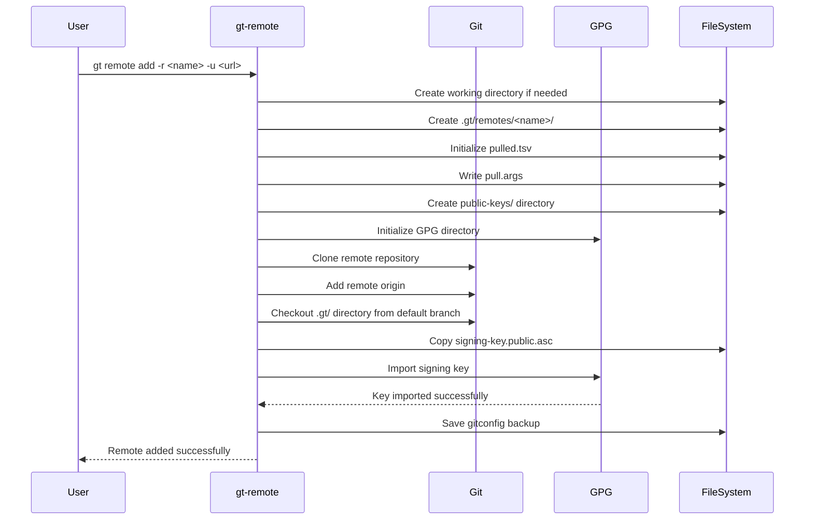
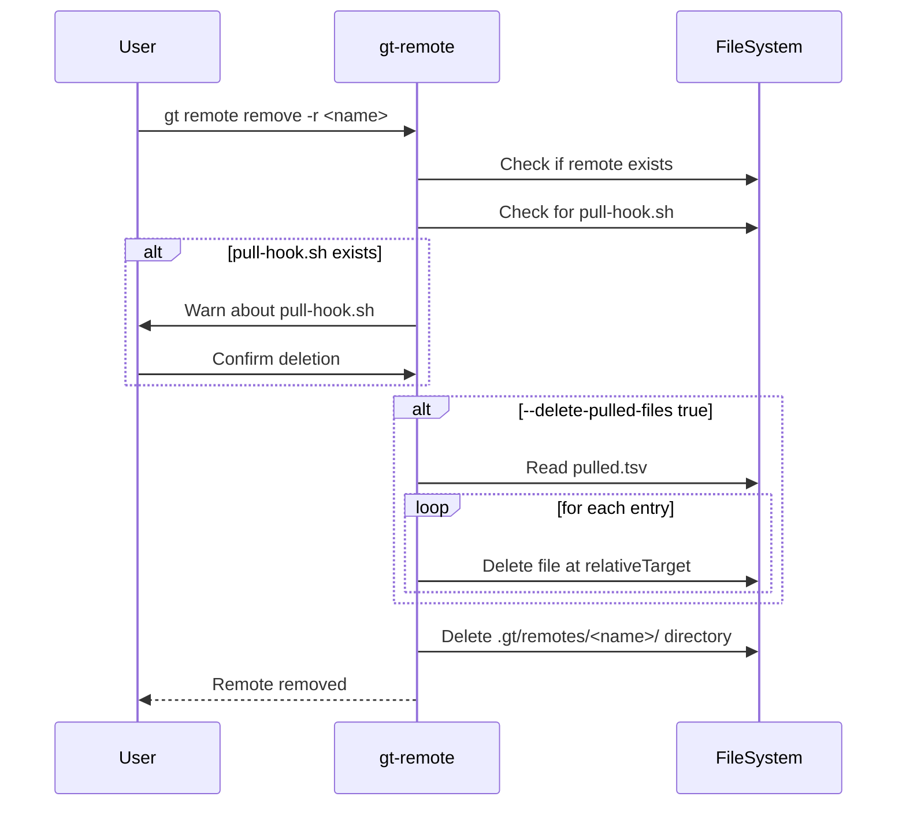

# gt remote - Specification

## Overview

The `gt remote` command manages Git remotes from which files can be pulled. It handles adding, removing, and listing remotes with automatic GPG key setup.

---

## Subcommands

### 1. `gt remote add`

Adds a new remote repository.

#### Parameters

| Parameter | Pattern | Required | Description |
|-----------|---------|----------|-------------|
| `-r, --remote` | `<name>` | Yes | Name identifying this remote (alphanumeric, `-`, `_`) |
| `-u, --url` | `<url>` | Yes | URL of the remote repository |
| `-d, --directory` | `<path>` | No | Directory for pulled files (default: `lib/<remote>`) |
| `--tag-filter` | `<regex>` | No | Regex to filter tags (default: `.*`) |
| `--unsecure` | `true\|false` | No | Skip GPG key requirement (default: `false`) |
| `-w, --working-directory` | `<path>` | No | Working directory (default: `.gt`) |

#### Workflow



#### Validation Rules

1. Remote name must match regex: `^[a-zA-Z0-9_-]+$`
2. Working directory must be inside current directory
3. Remote directory must not exist (or be cleaned up if empty)
4. Remote must have `.gt/` directory in default branch
5. Remote must have `signing-key.public.asc` in `.gt/` (unless `--unsecure`)
6. GPG key must be importable (unless `--unsecure`)

#### Side Effects

- Creates `.gt/remotes/<remote>/` directory structure
- Initializes GPG home directory
- Clones remote repository to `.gt/remotes/<remote>/repo/`
- Imports GPG signing key
- Creates `pull.args` with default arguments
- Optionally updates `.gitignore`

#### Examples

```bash
# Basic add
gt remote add -r tegonal-scripts -u https://github.com/tegonal/scripts

# Custom pull directory
gt remote add -r tegonal-scripts -u https://github.com/tegonal/scripts -d scripts/lib/tegonal-scripts

# With tag filter
gt remote add -r tegonal-scripts --tag-filter "^v[0-9]+\.[0-9]+\.[0-9]+$"

# Without GPG verification
gt remote add -r tegonal-scripts -u https://github.com/tegonal/scripts --unsecure true

# Custom working directory
gt remote add -r tegonal-scripts -u https://github.com/tegonal/scripts -w .github/.gt
```

---

### 2. `gt remote remove`

Removes an existing remote.

#### Parameters

| Parameter | Pattern | Required | Description |
|-----------|---------|----------|-------------|
| `-r, --remote` | `<name>` | Yes | Name of the remote to remove |
| `--delete-pulled-files` | `true\|false` | No | Delete pulled files (default: `false`) |
| `-w, --working-directory` | `<path>` | No | Working directory (default: `.gt`) |

#### Workflow



#### Behavior

- By default, keeps pulled files on disk
- With `--delete-pulled-files true`, reads `pulled.tsv` and deletes all listed files
- Warns if `pull-hook.sh` exists
- Removes entire remote directory structure

#### Examples

```bash
# Remove remote, keep files
gt remote remove -r tegonal-scripts

# Remove remote and delete pulled files
gt remote remove -r tegonal-scripts --delete-pulled-files true

# Custom working directory
gt remote remove -r tegonal-scripts -w .github/.gt
```

---

### 3. `gt remote list`

Lists all configured remotes.

#### Parameters

| Parameter | Pattern | Required | Description |
|-----------|---------|----------|-------------|
| `-w, --working-directory` | `<path>` | No | Working directory (default: `.gt`) |

#### Output

Returns one remote name per line, sorted alphabetically.

```bash
# Example output
tegonal-scripts
gt
my-remote
```

#### Examples

```bash
# List all remotes
gt remote list

# Custom working directory
gt remote list -w .github/.gt
```

---

## Remote Directory Structure

After `gt remote add`, the following structure is created:

```
.gt/remotes/<REMOTE_NAME>/
├── repo/                  # Git clone of the remote
├── public-keys/
│   ├── *.asc             # Imported public GPG keys
│   └── gpg/              # GPG home directory
├── pulled.tsv            # Initially empty (just header)
├── pull.args             # Stored pull arguments
├── pull-hook.sh          # Not created automatically
└── gitconfig             # Backup of remote's git config
```

---

## Error Handling

| Error Condition | Exit Code | Message |
|-----------------|-----------|---------|
| Remote name invalid format | 1 | Remote names need to match regex `^[a-zA-Z0-9_-]+$` |
| Working directory outside current dir | 1 | Path named is outside of current directory |
| Remote already exists | 1 | Remote already exists with pulled files |
| No .gt/ in remote | 1 | Remote has no .gt directory defined |
| No signing-key.public.asc | 1 | Remote has no signing-key.public.asc |
| GPG key import failed | 1 | No GPG keys imported |
| User cancelled | 9 | Operation aborted by user |

---

## Implementation Notes

### Key Import Callback

During `gt remote add`, keys are imported with a callback:

```bash
function gt_remote_importKeyCallback() {
    ((++numberOfImportedKeys))
}
```

This callback is invoked by `importRemotesPulledSigningKey` for each key imported.

### Cleanup on Exit

If the command fails, the remote directory is cleaned up and recreated empty:

```bash
trap "gt_remote_cleanupRemoteOnUnexpectedExit '$remoteDir'" EXIT
```

### Git Default Branch Detection

The tool detects the remote's default branch (main/master) to fetch `.gt/` directory:

```bash
defaultBranch=$(determineDefaultBranch "$workingDirAbsolute" "$remote")
```
