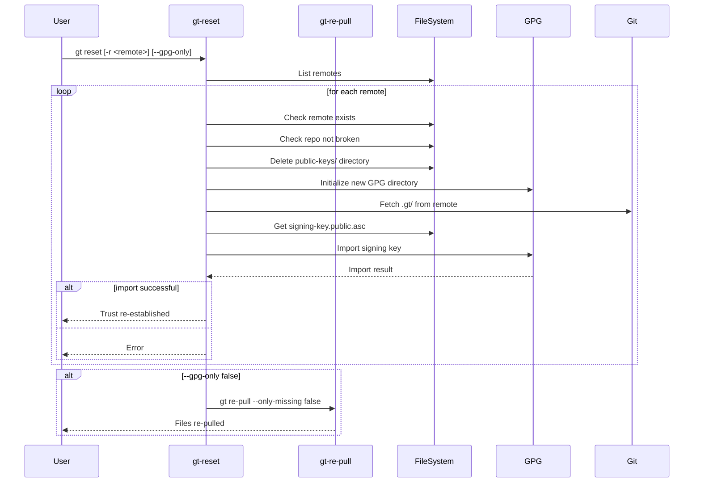
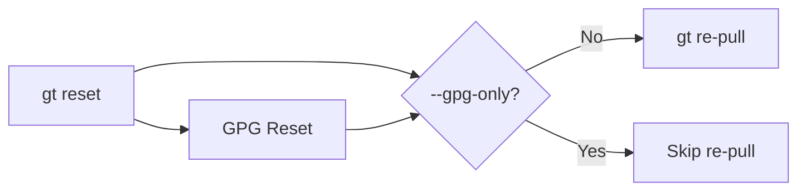

# gt reset - Specification

## Overview

The `gt reset` command re-establishes GPG trust for one or all remotes and optionally re-pulls all files. It's used to recover from GPG issues or refresh the trust state.

---

## Parameters

| Parameter | Pattern | Required | Description |
|-----------|---------|----------|-------------|
| `-r, --remote` | `<name>` | No | Remote to reset (default: all remotes) |
| `--gpg-only` | `true\|false` | No | Only reset GPG, skip re-pull (default: `false`) |
| `-w, --working-directory` | `<path>` | No | Working directory (default: `.gt`) |

---

## Workflow



---

## Detailed Steps

### 1. GPG Reset

```bash
function gt_reset_resetRemote() {
    # Delete existing public keys
    deleteDirChmod777 "$publicKeysDir"
    
    # Create fresh directory
    mkdir "$publicKeysDir"
    
    # Initialize GPG
    initialiseGpgDir "$gpgDir"
    
    # Fetch .gt/ directory from remote
    checkoutGtDir "$workingDirAbsolute" "$remote" "$defaultBranch" "$defaultWorkingDir"
    
    # Import signing key
    importRemotesPulledSigningKey "$workingDirAbsolute" "$remote" gt_reset_importKeyCallback
}
```

### 2. Unsecure Mode Check

If `pull.args` contains `--unsecure true` or `--unsecure-no-verification true`:

```bash
if [[ -n $unsecureArgs ]]; then
    logWarning "no .gt directory defined, ignoring it because %s was specified" "$unsecureArgs"
    return 0  # Skip GPG setup
fi
```

### 3. Key Import

```bash
function gt_reset_importKeyCallback() {
    ((++numberOfImportedKeys))
}

importRemotesPulledSigningKey "$workingDirAbsolute" "$remote" gt_reset_importKeyCallback

if ((numberOfImportedKeys == 0)); then
    if [[ -n $unsecureArgs ]]; then
        logWarning "no GPG keys imported, ignoring it"
        return 0
    else
        exitBecauseSigningKeyNotImported "$remote" "$publicKeysDir" "$gpgDir" "$unsecureParamPatternLong" "$signingKeyAsc"
    fi
fi
```

### 4. Re-pull (if not --gpg-only)

```bash
if [[ $gpgOnly != true ]]; then
    gt_re_pull -w "$workingDirAbsolute" --only-missing false -r "$remote"
fi
```

---

## Examples

```bash
# Reset all remotes (GPG + re-pull)
gt reset

# Reset specific remote (GPG + re-pull)
gt reset -r tegonal-scripts

# Only reset GPG keys, don't re-pull files
gt reset --gpg-only true

# Only reset GPG for specific remote
gt reset -r tegonal-scripts --gpg-only true

# Custom working directory
gt reset -w .github/.gt -r tegonal-scripts
```

---

## State After Reset

| Component | State |
|-----------|-------|
| `public-keys/` | Fresh, re-imported keys |
| `gpg/` | Re-initialized GPG home |
| `pulled.tsv` | Unchanged |
| Pulled files | Re-fetched (unless --gpg-only) |

---

## Error Handling

| Error Condition | Exit Code | Message |
|-----------------|-----------|---------|
| Remote not found | 1 | Remote directory does not exist |
| Repo broken | 1 | Git repository is corrupted |
| No .gt/ in remote | 1 | Remote has no .gt directory |
| No signing-key.public.asc | 1 | Remote has no signing key |
| Key import failed | 1 | No GPG keys imported |
| User cancelled | 9 | Operation aborted |

---

## Use Cases

### 1. Key Revocation

When a signing key is revoked:
```bash
gt reset -r <remote>
```

### 2. GPG Corruption

When GPG directory is corrupted:
```bash
gt reset -r <remote>
```

### 3. Trust Reset

When you want to re-confirm trust in keys:
```bash
gt reset
```

### 4. GPG-Only Recovery

When you only need to fix GPG without re-pulling:
```bash
gt reset --gpg-only true
```

---

## Implementation Notes

### Remote Iteration

```bash
function gt_reset_allRemotes() {
    gt_remote_list_raw -w "$workingDirAbsolute" >&7
    local -i count=0
    local remote
    while read -u 8 -r remote; do
        gt_reset_resetRemote "$remote"
        ((++count))
    done
}
```

### Unsecure Arguments Detection

```bash
if [[ -f $pullArgsFile ]]; then
    unsecureArgs=$(grep -E "(--unsecure|--unsecure-no-verification)\s*true" "$pullArgsFile")
else
    unsecureArgs=""
fi
```

### Default Branch Detection

```bash
defaultBranch=$(determineDefaultBranch "$workingDirAbsolute" "$remote")
```

---

## Relationship to Other Commands



The reset command:
1. First resets GPG trust (like `gt remote add` but for existing remotes)
2. Then optionally re-pulls files (via `gt re-pull --only-missing false`)
