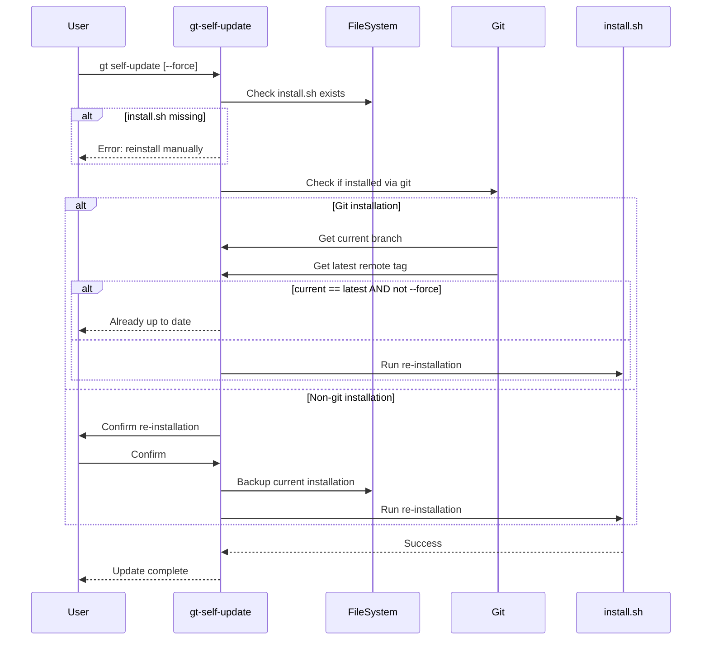

# gt self-update - Specification

## Overview

The `gt self-update` command updates the gt tool itself to the latest version using the original `install.sh` script.

---

## Parameters

| Parameter | Pattern | Required | Description |
|-----------|---------|----------|-------------|
| `--force` | `true\|false` | No | Force re-installation (default: `false`) |

---

## Workflow



---

## Detailed Steps

### 1. Installation Directory Detection

```bash
installDir="$(readlink -m "$dir_of_gt/..")"
```

### 2. install.sh Check

```bash
if ! [[ -f "$installDir/install.sh" ]]; then
    die "looks like the previous installation is corrupt, there is no install.sh in %s" "$installDir"
fi
```

### 3. Git Installation Check

```bash
if [[ -d "$installDir/.git" ]]; then
    # Git-based installation
    cd "$installDir"
    currentBranch=$(currentGitBranch)
    latestTag=$(latestRemoteTag)
    
    if [[ $currentBranch == "$latestTag" ]]; then
        logInfo "latest version of gt (%s) is already installed" "$latestTag"
        if [[ $forceInstall != true ]]; then
            return 0  # Already up to date
        fi
    fi
else
    # Non-git installation
    ask user to confirm re-installation
fi
```

### 4. Re-installation

```bash
# Create backup
tmpDir=$(mktemp -d -t gt-install-XXXXXXXXXX)
cp -r "$installDir" "$tmpDir/gt"

# Run installer
cd "$tmpDir/gt"
./install.sh --directory "$installDir"
```

---

## Examples

```bash
# Update to latest version
gt self-update

# Force re-installation even if already up to date
gt self-update --force
```

---

## Output Messages

### Already Up to Date (Git Installation)

```
latest version of gt (<tag>) is already installed, nothing to do in addition 
(specify --force true if you want to re-install)
```

### Force Installation

```
latest version of gt (<tag>) is already installed, but '--force true' was specified, 
going to re-install it
```

### Non-Git Installation

```
looks like you did not install gt via install.sh (<path>/.git does not exist)
Do you want to run the following command to replace the current installation 
with the latest version:
install.sh --directory "<installDir>"
```

---

## Error Handling

| Error Condition | Exit Code | Message |
|-----------------|-----------|---------|
| install.sh missing | 1 | Corrupt installation, reinstall manually |
| User cancels confirmation | 1 | Aborted self update |
| install.sh fails | 1 | Propagated from install.sh |

---

## Implementation Notes

### Temporary Directory

```bash
tmpDir=$(mktemp -d -t gt-install-XXXXXXXXXX)
cp -r "$installDir" "$tmpDir/gt"
cd "$tmpDir/gt"
```

The temporary directory is used to:
1. Preserve the current installation during the update
2. Run the installer from a clean environment

### Directory Preservation

The `--directory` flag ensures the new installation goes to the same location:

```bash
./install.sh --directory "$installDir"
```

---

## Relationship to install.sh

`gt self-update` essentially wraps `install.sh`:

```
gt self-update
  └─> Check if update needed
      └─> ./install.sh --directory <installDir>
```

The installer handles:
1. Downloading the latest version
2. Verifying GPG signatures
3. Replacing files in the installation directory

---

## Use Cases

### 1. Normal Update

```bash
gt self-update
```

### 2. Re-install After Manual Changes

```bash
gt self-update --force
```

### 3. Recovery from Corruption

If `install.sh` is missing, manual reinstallation is required:

```bash
# Download and run install.sh manually
wget "https://raw.githubusercontent.com/tegonal/gt/main/install.sh"
chmod +x install.sh
./install.sh --directory <installDir>
```

---

## Version Detection

### Git Installation

```bash
currentBranch=$(currentGitBranch)  # e.g., "v1.6.3"
latestTag=$(latestRemoteTag)       # e.g., "v1.6.3"
```

### Comparison

```bash
if [[ $currentBranch == "$latestTag" ]]; then
    # Already on latest version
fi
```

---

## Side Effects

1. Downloads latest gt version
2. Verifies GPG signatures
3. Replaces files in installation directory
4. Preserves configuration (working directory, remotes, etc.)
