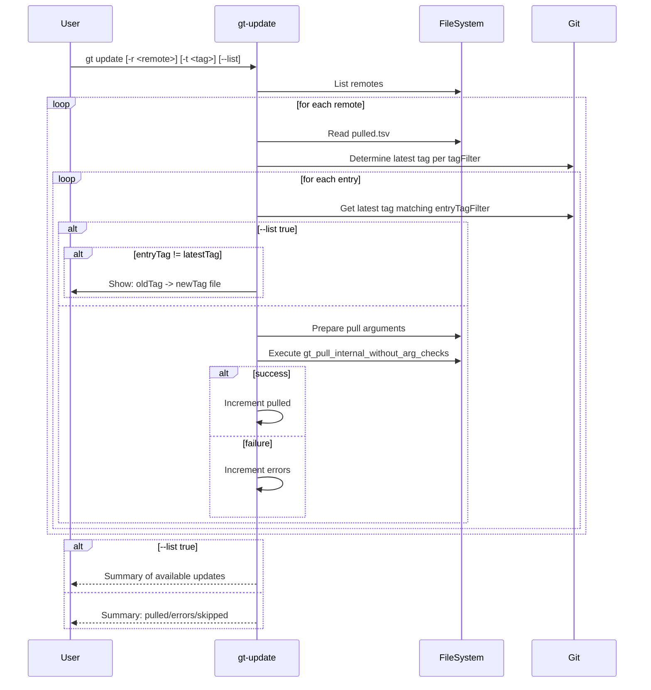

# gt update - Specification

## Overview

The `gt update` command updates already pulled files to their latest available versions based on their tag filters. It can also list available updates without applying them.

---

## Parameters

| Parameter | Pattern | Required | Description |
|-----------|---------|----------|-------------|
| `-r, --remote` | `<name>` | No | Remote to update (default: all remotes) |
| `-t, --tag` | `<tag>` | No | Specific tag to update to (only with `-r`) |
| `--list` | `true\|false` | No | List available updates (default: `false`) |
| `--auto-trust` | `true\|false` | No | Auto-trust GPG keys (default: `false`) |
| `-w, --working-directory` | `<path>` | No | Working directory (default: `.gt`) |

---

## Workflow



---

## Tag Resolution

### Per-File Tag Filtering

Each file has its own `tagFilter` stored in `pulled.tsv`. The latest tag is determined per file:

```bash
# First file with a given tagFilter
tagToPull=$(latestRemoteTagIncludingChecks "$workingDirAbsolute" "$remote" "$entryTagFilter")

# Subsequent files with same tagFilter are cached
if [[ "$previousTagFilter" == "$entryTagFilter" ]]; then
    tagToPull="$previousLatestTag"
else
    # Determine new latest tag
fi
```

### Tag Filter Matching

```bash
# Check if specified tag matches entry's tagFilter
if ! grep -E "$entryTagFilter" >/dev/null <<<"$tagToPull"; then
    # Tag doesn't match, skip this file
    ((++skipped))
    return
fi
```

---

## Update Modes

### 1. Latest Tag (default)

Updates each file to the latest tag matching its `tagFilter`:

```bash
# For each unique tagFilter, find latest matching tag
tagToPull=$(latestRemoteTagIncludingChecks "$workingDirAbsolute" "$remote" "$entryTagFilter")
```

### 2. Specific Tag

Updates all files to a specific tag (if they match the tagFilter):

```bash
# When -t <tag> is specified
tagToPull="$tag"

# Check if tag matches file's filter
if ! grep -E "$entryTagFilter" >/dev/null <<<"$tagToPull"; then
    ((++skipped))
    return
fi
```

### 3. List Mode

Shows available updates without applying them:

```bash
if [[ $list == true ]]; then
    if [[ $entryTag != "$tagToPull" ]]; then
        updatablePerRemote+=("$entryTag" "$tagToPull" "$entryFile")
    fi
fi
```

---

## Examples

```bash
# Update all files of all remotes to latest
gt update

# Update all files of specific remote to latest
gt update -r tegonal-scripts

# Update/downgrade to specific tag
gt update -r tegonal-scripts -t v1.0.0

# List available updates
gt update -r tegonal-scripts --list true
```

---

## Output Formats

### List Mode

```
following the updates for remote <remote>:
Old     New     File
v1.0.0  v1.1.0  src/script.sh
v2.0.0  v2.1.0  src/config.yaml

1 updates available, see above.
```

### Update Mode

```
3 files updated in 5 seconds (2 skipped)
```

Or with errors:

```
2 files updated in 5 seconds (3 skipped), 1 errors occurred, see above
```

---

## State Tracking

| Counter | Description |
|---------|-------------|
| `pulled` | Files successfully updated |
| `skipped` | Files skipped (tag doesn't match filter or no update needed) |
| `errors` | Files that failed to update |
| `updatable` | Number of files with available updates (list mode) |

---

## Validation

### Tag Existence Check

When a specific tag is provided:

```bash
if [[ -n $tag ]] && ! (cd "$repo" && hasRemoteTag "$tag" "$remote"); then
    # Suggest similar tags in same major version
    majorVersion=$(sed -E 's/^(v?[0-9]+)\..*/\1/' <<<"$tag")
    remoteTags=$(cd "$repo" && remoteTagsSorted "$remote" -r)
    filteredTags=$(grep -E "^v?${majorVersion#v}" <<<"$remoteTags")
    
    if [[ -n $filteredTags ]]; then
        die "remote %s does not have tag %s\nAvailable tags in same major version:\n%s"
    else
        die "remote %s does not have tag %s nor any tags in same major version"
    fi
fi
```

### Remote/Tag Combination

```bash
if [[ -n $tag && -z $remote ]]; then
    die "tag can only be defined if a remote is specified via --remote"
fi
```

---

## Implementation Notes

### Argument Caching

To avoid re-parsing arguments for each file:

```bash
# Parse once before processing entries
if [[ $list != true ]]; then
    gt_pull_parse_args gt_pull_parsed_args "$currentDir" \
        "$workingDirParamPatternLong" "$workingDirAbsolute" \
        "$remoteParamPatternLong" "$remote" \
        ...
fi
```

### Tag Filter Caching

```bash
local previousTagFilter=""
local previousLatestTag=""

# In callback:
if [[ "$previousTagFilter" == "$entryTagFilter" ]]; then
    tagToPull="$previousLatestTag"  # Use cached value
else
    tagToPull=$(latestRemoteTagIncludingChecks ...)
    previousLatestTag="$tagToPull"
    previousTagFilter="$entryTagFilter"
fi
```

### Update Arguments

For each file, modify the cached arguments:

```bash
gt_pull_parsed_args[2]=$tagToPull      # tag
gt_pull_parsed_args[3]=$entryFile      # path
gt_pull_parsed_args[4]=$parentDir      # directory
gt_pull_parsed_args[6]=$entryTargetFileName  # target-file-name
gt_pull_parsed_args[7]=$entryTagFilter       # tag-filter
```

---

## Differences from gt re-pull

| Feature | gt update | gt re-pull |
|---------|-----------|------------|
| Tag | Latest (or specified) | Original tag |
| Purpose | Update versions | Restore files |
| Tag filter | Applied | Applied |
| Default behavior | Update all | Missing only |

---

## Error Handling

| Error Condition | Behavior |
|-----------------|----------|
| Remote not found | Skip remote |
| pulled.tsv missing | Skip remote |
| Tag not found | Error with suggestions |
| Tag filter mismatch | Skip file (not error) |
| Pull fails | Increment error counter |

---

## Placeholder Handling

Files with placeholders are handled by `replaceGtPlaceholdersDuringUpdate`:

```bash
# During the pull process (called from gt_pull_internal_without_arg_checks)
if [[ $entryHasPlaceholder == true ]]; then
    replaceGtPlaceholdersDuringUpdate "$remote" "$repo" "$entryFile" \
        "$absoluteTarget" "$source" "$entryTag" "$tagToPull"
fi
```

This ensures user modifications in placeholders are preserved during updates.
